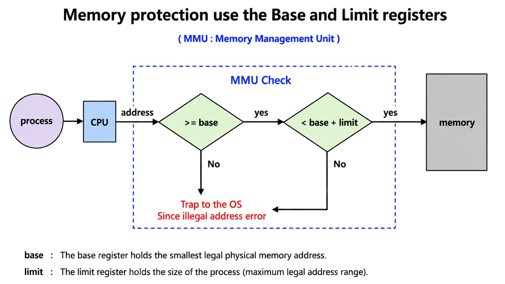
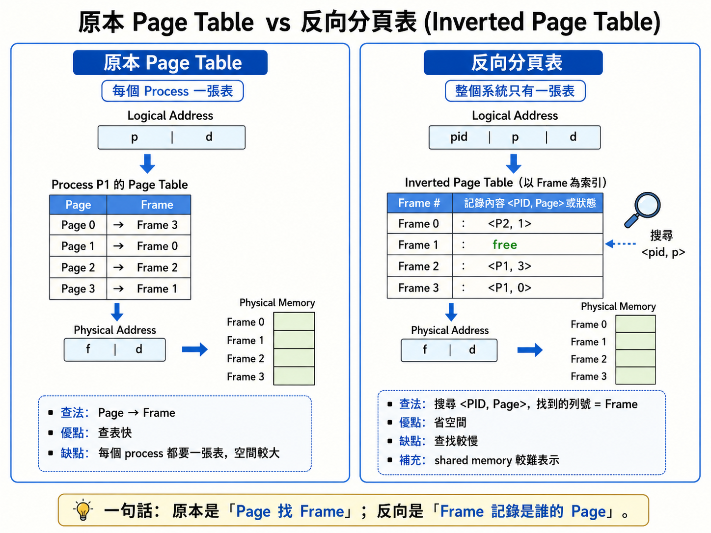
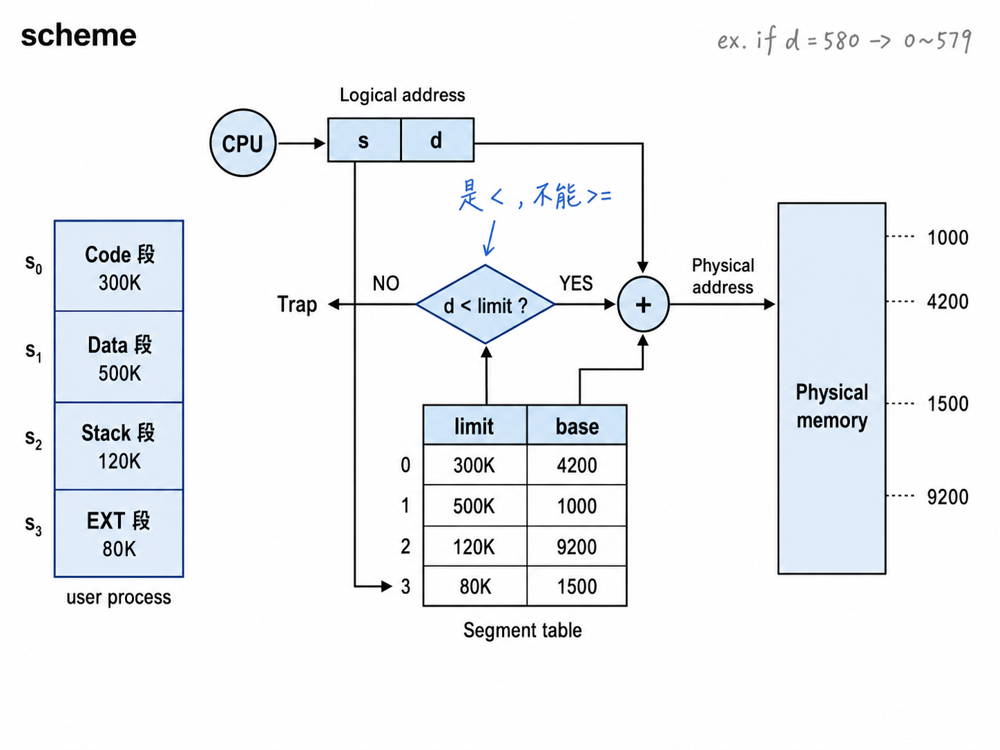
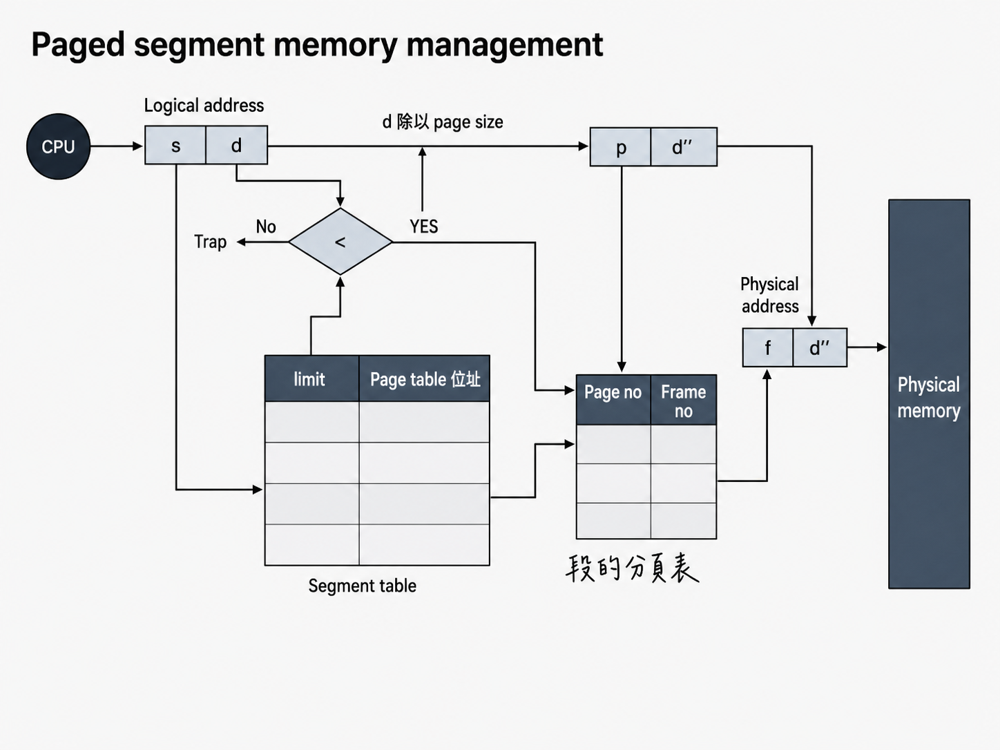

> 本章內容 : 作業系統如何管理「主記憶體（RAM）」：讓多個行程安全、有效率地共用有限的記憶體。
# 前導 
- 為什麼「主記憶體管理」很重要？
    - CPU 只能直接存取主記憶體

    - 記憶體是：
        - 昂貴
        - 有限

    - 多個行程要一起用
        - OS 必須解決三個核心問題：
        - 誰用哪一塊記憶體？
        - 怎麼防止程式亂讀／亂寫別人的記憶體？
        - 怎麼讓記憶體使用率最高？

--- 

# 摘要
## BackGround

- CPU 能直接存取的很少，只有**Main Memory**和 **Registers**而已
- Disk 上的程式，只是「檔案」而已，**要被Loader載入memory才會變成Process**
- 把多個程式放進 RAM → 多程式（multiprogramming）: **改善CPU使用率**以及**加快反應時間**
- process 會移動在**Disk**和**memory**之間

## Memory Management Issues
- How to refer to memory in a program? → Address binding
- How to load a program into memory? → static/dynamic loading & linking
- How to move a program between memory and disk? → Swapping
- How to allocate memory? → Paging, Segmentation

## Multistep Processing
1. Source program（原始碼）
2. Compiler/Assembler → Object module（目標檔 .o）
3. Linkage editor（linker）
    - 把你的 object 檔 + 其他 object 檔 + library 接起來
4. 產生 Load module（可載入檔 / executable）
5. Loader
    - OS/loader 把 load module 放到 RAM，形成 in-memory binary image（記憶體中的程式映像）
6. Dynamic linking（動態連結）
    - 有些 library 不會在 linker 時就塞進去
    會在「執行時」才載入/連結（例如共享函式庫 .so / .dll）

- 因為「位址到底何時決定」有三種：

    - 編譯期決定（compile time）
    - 載入期決定（load time）
    - 執行期決定（execution time）

--- 
# 基本觀念
- 每個Process會有自己的獨立記憶體空間，且不可以去存取其他Processes 的記憶體空間
- 先前的Memory Protection (連續性)配置下
    - BaseResister + Linit Register



# Address Binding

> 前兩個是Static Binding
> 後一個是Dynamic Binding

## Compile Time（編譯期綁定）
- 程式一開始寫的是symbolic address(符號位址)
    > symbolic address : 在寫程式、編譯之前或剛編譯完，程式裡出現的位址通常是：變數名稱、函式名稱、label、相對位置
- 在編譯期就決定他在Memory的**絕對位址**，編譯器就會產生**絕對位址**

✅ 結論
- 優點：簡單、快（不用 relocation）
- 缺點：起始位置一改就完蛋 → 必須**重新編譯**（recompile）
- 例子：老系統 MS-DOS .COM 程式（固定載入位置）

## Load Time（載入期綁定）
- 由linking loader / **linking Editor**執行Binding
- 編譯器不產生寫死的絕對位址，而是產生 relocatable code（可重定位碼）
- 程式碼裡用「相對於起點」的方式表示位址（Ex. BS + 0x18）

✅ 結論（考點）
- 優點：同一份 executable 可以載入到不同位置
- 缺點：如果起點改了 → 不用重編譯，但要**重新載入**（reload）
- 這需要 loader 做 relocation（重定位）（通常靠 relocation table）

## Execution Time（執行期綁定）
> 現代 OS 幾乎都用這個。
- Binding 工作延遲到Run Time
- 程式看到的是 **logical address**(i.e., virtual address)
    - 例如它可能以為 data 在 0x18
- 真正的 physical address（例如 0x2018）由**special hardware**(ex.the MMU) 在每次記憶體存取時「**即時轉換**」
    - MMU : CPU 發出 virtual address → MMU 翻成 physical address

✅ 結論（超常考）
- 優點：
    - 程式可以在執行途中被搬家（支援 swapping / relocation / virtual memory）
    - 每個 process 都可以有「**自己的位址空間**」（安全、隔離）
- 缺點：
    - 需要硬體支援（MMU），會有轉換成本（靠 TLB 加速）


## Memory-Management Unit(MMU)
- MMU 是 CPU 裡的硬體元件，在程式執行時把 **Virtual/Logical Address（虛擬/邏輯位址）→ Physical Address（實體位址）**。
- Translation mechanism : 

$$
Physical Address = Base Register (relocation register) + Logical Address
$$

- 例子 : 
    - CPU 產生 Logical Address = `346` 
    - relocation register 位址 `12000`
    - Physical Address = Base + Logical = `12000` + `346` = `12346`
    - 最後去 Memory 存取 `12346`
- ✅優點：
    - Memory protection（保護）
        - 每個 process 只能在自己的範圍內活動。
    - Dynamic relocation（動態搬家）
        - base 改掉，整個程式的位址就「等效搬家」，不用重編譯。
    - 支援 virtual memory

## Logical v.s. Physical Address

> User program 只用 logical address，不需要知道 physical memory 在哪。

- Logical Address（= Virtual Address）
    - 也就是你程式碼多大
    - **CPU 在執行時產生的位址**
    - 使用者程式看得到、操作的位址空間

- Physical Address
    - **RAM 裡真正的位址**
    - 最終由記憶體硬體去存取

- 跟 Address Binding 的關係

    | 項目                        | Compile-time / Load-time Binding | Execution-time Binding |
    | ------------------------- | -------------------------------- | ---------------------- |
    | **位址綁定時機**                | **執行前**（compile 或 load 時）        | **執行中**（run time）      |
    | **位址是否先定死**               | ✅ 是，已定成實體位址                      | ❌ 否，執行時才轉換             |
    | **Logical address**       | = Physical address               | ≠ Physical address     |
    | **是否需要 MMU**              | ❌ 不需要                            | ✅ 需要                   |

--- 

# Load Program  into Memory → static/dynamic loading & linking

## Dynamic Loading

> 不需要整個 Program 載入 Memory → 用到再載入就好
- 只需載入**被呼叫**的程式碼進記憶體就好
- 沒被執行的就放在硬碟就好了

- ✅優點： **改善Memory utilization**
- 實作 : 其實他理論上來說**可以不用OS提供新的支援**，可以用使用者層的方法做到

## Static Linking
- **在link time時**，將有用到的Libraries打包進可執行檔 → **單一包含所有需要程式的執行檔**
- 特性 :
    - 缺點：記憶體浪費（duplicate library code）: 多個程式各自帶一份 libc → RAM 會出現**多份重複**

✅優點：
- 執行快
    -  不用在 runtime 做符號解析（resolve），呼叫可直接跳
- 自給自足
    - 不怕機器上缺 library（部署比較直覺）

**Static Linking with Dynamic Loading**
- 核心/常用部分：靜態連結
- 某些模組：用 dynamic loading 按需載入
- **但重複碼問題仍在**：因為靜態連結的 library 每個 process 仍各有一份。

**Trade-off Analysis**

| 面向                  | 重點                                   |
| ------------------- | ------------------------------------ |
| **Memory usage**    | ❌ 浪費（library **無法共用**，每個 process 一份） |
| **Execution speed** | ✅ 快（**direct calls**）                |
| **Deployment**      | ✅ 簡單（**無相依 library**）                |
| **Updates**         | ❌ 不彈性（library 更新 → **需重新編譯/發佈**）     |

## Dynamic Linking
> Dynamic linking = 第一次呼叫要辦手續，之後就走快速通關
- 概念 : 
    - 連結時機延後到執行期（run time）
    - Executable 不直接包含整套 library
    - 只放 library function 的引用點（references）
- 關鍵機制:
    - 在 executable 中 ， 每個 library function 呼叫點 ， 插入一小段程式碼 → stub
- **需要OS額外支持**，OS是唯一可以檢查其所需要ㄉroutine是在其他Processes所在的記憶體區域


✅優點 : **Memory Efficiency**
- **Single copy of library code shared across all processes**
- 多個程式使用同一個 library（如 libc）
- RAM 中只需要一份 library code（共享）
- 助Library自動更新且無須relinking (記，少考)

第一次呼叫 library function（First call）
- 程式先跳到 stub
- stub 檢查：
    - library 是否已載入
    - 該 function symbol 是否已解析
- 若尚未完成：
    - 載入 library 
    - 解析 symbol（binding）
- 跳到真正的 library function 執行

後續呼叫（Subsequent calls）:
- 不再做載入與解析
- stub 已更新跳轉位址
- 直接跳到 function
→ 執行速度接近 static linking

## Static / Dynamic Loading & Linking：Four Combinations
> Loading：什麼時候把 code 放進 RAM（startup vs on-demand）
> Linking：什麼時候把外部符號/library 接起來（link time vs run time）

| 組合                                               | Linking（連結） | Loading（載入）               | Pros（優點）        | Cons（缺點）                            | 常見 Use case       |
| ------------------------------------------------ | ----------- | ------------------------- | --------------- | ----------------------------------- | ----------------- |
| **(1) Static Linking + Static Loading**          | 編譯/連結時全部打包  | 程式啟動時整包載入                 | 最快、最單純、完全自給自足   | Executable 最大、RAM 最浪費               | Embedded、關鍵系統工具   |
| **(2) Static Linking + Dynamic Loading**         | 仍是靜態連結（不共享） | 用到模組才載入                   | 起始 RAM 較省、不怕缺庫  | 跨 process 的 library duplication 仍存在 | Plugin 架構         |
| **(3) Dynamic Linking + Static Loading**         | 執行期解析、可共享   | 啟動時就載入所有 shared libraries | 共享、省 RAM、更新較彈性  | 啟動較慢、可能載了用不到的庫                      | 傳統 shared library |
| **(4) Dynamic Linking + Dynamic Loading (Lazy)** | 執行期才解析      | 用到才載、用到才解析                | 最省 RAM、啟動快、彈性最高 | 第一次呼叫有 overhead、實作較複雜               | 大型應用、現代 OS 預設     |

易混淆觀念對照

| 問題                       | 正確理解                                                       |
| ------------------------ | ---------------------------------------------------------- |
| **Dynamic loading 是什麼？** | 決定「**程式碼何時進 RAM**」（用到才載）                                   |
| **Dynamic linking 是什麼？** | 決定「**何時解析/接上 library 符號**」（執行期，靠 stub）                     |
| **差別一句話**                | 一個管 **載入時機**，一個管 **連結解析時機**                                |
| **dlopen 算什麼？**          | 課件中視為 **dynamic loading 的典型例子**（實務上同時牽涉 loading + linking） |

--- 

# Swapping

## 定義 : 
- Swapping = 把整個 process 在 **Memory** 與 **backing store**之間搬移，之後可以再搬回來接著執行

不同的點 : 
- Scope : Entire process image
- Scheduler : **Medium-term scheduler operation**
- Swapping vs Context Switch :  
    - Swapping : 把 process 直接搬去 disk（人都不在 RAM 了）
    - Context Switch : 只是換 CPU 跑誰（process 都還在 RAM）

**Bccking Store**
- Dedicated disk partition separate from file system
- direct block access to memory images
- Must accommodate **all swapped processes**

**Swapping Triggers**
- Memory pressure : RAM 快不夠
- Priority-based scheduling (Roll-out/Roll-in) : 高優先權的 process 需要 RAM → 把低優先權的「roll-out」出去

## Swap-back Memory Address Requirements

| Binding 類型                 | Swap in 可否到不同位址？        | 原因（考試重點）                                                             |
| -------------------------- | ----------------------- | -------------------------------------------------------------------- |
| **Compile-time binding**   | ❌ 不行（same address）      | 使用**寫死的絕對位址**，放到別的位址會造成所有指令位址錯誤                                      |
| **Load-time binding**      | ❌ 不行（same address）      | **Relocation 在載入時已完成**，位址已被定死                            |
| **Execution-time binding** | ✅ 可以（different address） | 有 **MMU**，Logical → Physical 於 **runtime** 轉換，只需更新 base / page table |

## Swapping: I/O Problem
- The I/O Problem
    - Process P 正在等 I/O
    - OS 覺得 RAM 不夠 → 把 P swap out
    - I/O 完成時，DMA 會把資料寫到「P 原本的記憶體位置」
- 結果：**Data corruption**（資料毀損）

## Solution to I/O-Swapping Conflict:

### Solution 1 : Never swap processes with pending I/O
- swap 之前先檢查 I/O queue
- I/O 進行中就把該 process 標記為 non-swappable

### Solution 2 : Use OS-managed I/O buffers（kernel buffer）
- I/O 不要直接寫到 user space 的 buffer
- 改成先寫到 kernel buffer（不會被 swap）
- 等 process swap 回來後，再把資料 copy 回 user space

## Process Swapping to Backing Store

Swap time components : 
- **Transfer Time (dominant factor)** - Moving dadata between memory and disk
>   **正比於process size** : process 越大搬越久
- Latency : 磁碟的 seek + rotational delay
- Context switch overhead - OS bookkeeping 

--- 

# Memory Allocation Schemes (連續記憶體配置)

## Fixed-Partition Allocation
- 做法 ： 系統一開機就把 RAM 切成**固定大小的 partitions**
- 規則 ： 每個 process 只能佔一格 partition。
    - ✅ **Multiprogramming degree** = partitions 數量
        - 因為同時最多就塞得下「partition 個 process」
- **Partition selection** - First-fit or Best-fit within available partitions
- ✅ 優點：簡單（表格也說 Simple）
- ❌ 主要問題：**Internal fragmentation（內部碎裂）** - 因為 partition 固定大小，process 可能用不滿

## Variable-Partition Allocation
- 做法： 你要多少就切多少給你（依需求切一塊連續的）
- **hole**：一段連續的空閒記憶體區塊
- 多次 allocate/free 後，hole 會散落各處（各種大小）
- ✅ 優點：彈性高、初期利用率更好
- ❌ 主要問題：**External fragmentation（外部碎裂）**

## Multiple Partition (Variable-Size) Method（可變分割到底怎麼運作）
- 如果要分配 ， 找一個夠大的hole 切下來分配，會變成一個較小的hole(split)
- Data Structure
    - **Allocation Table（已配置表）**
        記每個 process 用哪一段：(PID, base, limit)
    - **Free List（空閒表）**
        - 記所有 holes：(base address, size)
    - allocate/free 都要動態更新
- 相鄰的 holes 應該自動合併（merge）
- Implementation 
    - allocate：如果 hole 比需求大 → 切割
    - deallocate：釋放後變 hole → 看左右是否也是 hole，能合就合

## Dynamic Storage Allocation Problem
> 3個演算法
1. First-fit（第一個放得下就用）(O(n))
    - Next-fit 的變形
    - ✅ 優點：平均最快
    - 缺點：前面區域容易被切得很碎（很多小洞集中前面）
2. Best-fit（找「最小但夠用」的 hole）(O(n))
    - ✅ 好處：這次剩下的碎片最小（“看起來”很省）
    - ❌ 壞處（投影片紅字）：會產生很多超小、用不到的洞
3. Worst-fit（找最大的 hole）(O(n))
    - 挑最大的 hole 來切
    - 理論：留下的大碎片比較可能再放大 process

- First-fit 和 Best-fit 通常**勝過** Worst-fit
- First-fit 通常**最快**，而且利用率跟 best-fit 差不多
- Best-fit 不一定真的最優

## Memory Fragmentation
### External Fragmentation（外部碎裂）
- 定義(申論) : 在連續性配置下， 我們在AV-List找不到一個free hole size可以滿足process size，但free hole size加總卻 >= process size，但因為不連續所以無法配置給此processes

- Total free memory ≥ request size，但不連續（not contiguous）
- 出現在 Variable-size partition（可變分割）
- 所有連續性記憶體配置方法皆會**遭遇外部碎裂**
- 經驗法則顯示 : 約每 N 個 allocated blocks 會有 0.5N 個 holes ，**也就是大約有1/3 memory may be un useable， 又叫做 **50 percent rule** or **one-third rule**

### Internal Fragmentation（內部碎裂）
- 連續性配置沒有內部碎裂
- 已分配出去的 partition 裡面，但 process 沒用到的空間
- 出現在 Fixed-partition（固定分割）

### Solution : **Memory Compaction**
把所有 processes「搬到一起」，把 holes 集中成一個大洞
- 需要 **Dynamic binding**（execution-time binding）

- Constraints : 
    - 需要 relocatable code / MMU
    - overhead 很高：要搬「所有」process
    - 系統可能要暫停/凍結 在 compaction 期間


---

# Non-Contiguous Memory Allocation - Paging

## Paging Concept
- Core mechanism
    - **Physical memory（實體記憶體 RAM** 切成固定大小小格子：叫 frames
    - **Logical memory（邏輯/虛擬位址空間** 也切成一樣大小小格子：叫 pages
    - page/frame 大小通常是 2 的次方（4KB、8KB…）
        - 因為這樣「位址切割」可以用 bit 切：右邊 n bits 當 offset

- Process 要能執行，需要什麼？
    - 程式如果有 n pages，就需要 n 個可用 frames(不要求連續)
- OS 會維護：
    - **free frame list**：哪些 frame 還空著
    - **page table**：把每個 page 對到哪個 frame（做位址轉換）
- Address translation
    - Logical Address = [Page Number | Page Offset] 
    → (via page Table)→ 
    Pysical Address = [Frame Number | Page Offset]
    - 重點：**offset 不變**（因為 page 和 frame 大小一樣）

## Paging 的 4 大好處
這頁就是「為什麼 paging 比 variable partition 好」。

1) **Noncontiguous** allocation（可不連續）
- pages 可以散落在任何 frames
- OS 不用再煩惱找一大段連續洞

2) Eliminates external fragmentation（消除外部碎裂）
- 因為不再需要連續的大洞
- 所有空間都以 frame 為單位可用
> Paging 解掉 external fragmentation。

3) Minimal internal fragmentation（仍有少量內部碎裂）
- 只可能發生在 最後一頁（因為程式大小不一定剛好整除 page size）
- 平均浪費：半頁 / process
> Paging 沒有 external fragmentation，但有 internal fragmentation（平均半頁）。

4) Enables memory sharing（支援共享）
- 多個 process 可以把某些頁 map 到同一個 physical frame
- 常見：**共享的程式碼段**（shared libraries）、共享記憶體

### 壞處 

5) 會有**內部碎裂**
6) Pageing 可能會提升context switch Time
7) 需要硬體的支援
    - page table製作
    - Logical address -> Physical Address by MMU

## Page table fundamentals
- 把 logical page number → physical frame number
- 每個 process 一張 page table
- page table entry（PTE）至少要存：**frame number**

3 大特性 : 
1. Process isolation（隔離）
2. Memory protection（保護）
3. Address translation（轉換）

## Address Translation Scheme
Logical address 結構

- m-bit logical address
    - page number `p`：m-n bits
    - offset `d`：n bits

- `p`（page number）的意義
    - `p` 是 page table 的索引（index）
    - m-n bits → 最多可表示 2^(m-n) 個 pages
    - 最大 logical memory：
        - pages 數量 2^(m-n) × 每頁大小 2^n bytes
        - = `2^m` bytes（剛好對應 m-bit 位址空間）

- `d`（page offset）的意義
    - `d` 是「在 page/frame 裡面的位移」
    - n bits → page size = 2^n bytes
    - translation 時 d 不變
    - 最後 physical address = frame base address + d

**Translation formula**
- Physical Address = (Frame Number × Page Size) + Offset
= Frame base + d

## Address Translation
- Page size = 4KB = 2¹²→ Offset bits = 12
> 先看 page size → 算 offset bits
位址總 bits − offset bits = page / frame number bits
2^(number bits) = pages / frames 數量
2^(address bits) = 最大記憶體大小

1. Logical Address Space（32-bit）

    | 項目                   | 計算        | 結果           |
    | -------------------- | --------- | ------------ |
    | Logical address bits | 已知        | 32 bits      |
    | Offset bits          | 4KB = 2¹² | 12 bits      |
    | **Page number bits** | 32 − 12   | **20 bits**  |
    | Pages per process    | 2²⁰       | **1M pages** |
    | Max process size     | 2³² bytes | **4 GB**     |

2. Physical Address Space（36-bit）

    | 項目                    | 計算        | 結果             |
    | --------------------- | --------- | -------------- |
    | Physical address bits | 已知        | 36 bits        |
    | Offset bits           | 4KB = 2¹² | 12 bits        |
    | **Frame number bits** | 36 − 12   | **24 bits**    |
    | Total frames          | 2²⁴       | **16M frames** |
    | Total physical memory | 2³⁶ bytes | **64 GB**      |

3. Page Table（每個 process）

    | 項目                 | 計算            | 結果                   |
    | ------------------ | ------------- | -------------------- |
    | Page table 數量      | 每個 process 一張 | 1                    |
    | Page table entries | = pages 數量    | **2²⁰ = 1M entries** |

## Page/Frame Size Considerations

1) 為什麼 page size 由硬體決定、且必須是 2 的次方？
- 因為位址要用 bit 切：
    - 低 n bits = offset
    - 高位 = page/frame number
- 不是 2 的次方就不好用位元運算切割

2) 常見大小與趨勢
- 常見：4KB、8KB
- 範圍：512B 到 16MB
- 現代也有 huge pages（2MB、1GB）給特定工作負載

3) Internal fragmentation 分析
- 平均每個 process 的內部碎裂 ≈ page_size / 2
- **page 越大 → 浪費越多**（最後一頁平均半頁浪費會變大）

4) 為什麼歷史上 page size 變大？
- 記憶體系統變大（GB/TB 時代）
- dataset 變大（DB、科學運算）
- I/O 最佳化：page fault overhead 相對變高，頁大可以減少 fault 次數（某些情境）
- TLB 壓力：TLB entries 有限，頁大可以讓 TLB cover 更多記憶體（TLB reach 變大）

## Paging Summary
1. Memory Abstraction Achievement

| 使用者看到                     | OS / 硬體實際做的          |
| ------------------------- | -------------------- |
| 連續的 logical address space | Pages 分散在不連續的 frames |
| 0 ～ max 的連續空間             | MMU + page table 做轉換 |
| 感覺不到搬家                    | 位址轉換對程式 **透明**       |

2. OS 兩大關鍵資料結構

**Page Table（per-process）**
| 項目             | 說明                              |
| -------------- | ------------------------------- |
| 數量             | 每個 process 一張                   |
| 功能             | Logical pages → Physical frames |
| 提供             | 隔離、保護                           |
| Context switch | 需要切換 page table base            |


**Frame Table（system-wide）**
| 項目          | 說明                                     |
| ----------- | -------------------------------------- |
| 數量          | 全系統一張                                  |
| 對象          | 每個 physical frame 一個 entry             |
| 記錄內容        | free / allocated                       |
| 若被佔用        | owner：PID + page#（共享則是清單）              |
| 其他 metadata | reference count、dirty bit、lock status… |


---

# Implementation of Page Table

三種方法
1) 使用Register : 最簡單
    - 不須記憶體存取，所以快速
    - 對於大型Page Table 不適合，因為Register數量不構

2) Page table 存放（Storage）
    - Page tables reside in **main memory** (too large for registers)
    - **PTBR（Page-Table Base Register）**
        - 記錄分頁表在 memory 的位址
    - PTBR **存在 PCB(Process Control Block)**
    - 所以 context switch 時，OS 會把新 process 的 PTBR 載入（等於換一張 page table）
    - Memory access overhead
    - 沒有 TLB 時，每次存取一個 logical address 要做兩次記憶體存取：
        - 先去 memory 裡找 page table entry（用 PTBR + page#）
        - 再去 memory 裡拿真正資料（frame# + offset）

        | 情況           | 你要拿到「資料」前要做什麼      | 需要幾次 memory access |
        | ------------  | ------------------ | -----------------: |
        | 沒有 TLB       | 先查 page table，再讀資料 |                  2 |
        | 有 TLB 且 hit  | 直接得到 frame#，讀資料    |                  1 |
        | 有 TLB 但 miss | 查 page table + 讀資料 |                  2 |

3) Solution：TLB
- **TLB = Translation Look-aside Buffer**
    - 是在 MMU 裡的硬體 cache
    - 記最近用過的 page→frame 對應
    - 目的：讓大多數存取變成「一次 memory access」

## Associative Memory / CAM
TLB 用的記憶體型態是 Associative Memory / CAM（Content-Addressable Memory）
- 特色：不是用「位址」找資料，而是用「內容」找。

- Key characteristics

    - Parallel search：所有 entries 同時比對

    - Search by content：輸入 page number（通常還會加 ASID），輸出 frame number

    - Access time O(1)：不管幾筆，都像一次查找

| 項目   | CAM / TLB 的特性         | 代價       |
| ---- | --------------------- | -------- |
| 查找速度 | 平行比對，接近 O(1)          | 電路複雜、成本高 |
| 功耗   | 多路同時比較                | 耗電高      |
| 容量   | 不能太大（64–1024 entries） | 命中率受限    |

- Performance characteristics
    - TLB hit： 只要 1 次 memory access（直接去拿 data）
    - TLB miss： 變回 2 次（page table + data）
    - Replacement policy：常見 LRU（TLB 滿了要踢誰）


## Translation Lookaside Buffer (TLB) 
TLB 是什麼？
- **「硬體快取」**保存最近的 virtual→physical 轉換
- shared by all processes（同一顆 CPU 的 TLB 不是每個 process 一份）

但 shared 會有問題：context switch 後，舊 process 的轉換還留在 TLB

| 方法                 | 做法                           | 優點       | 缺點               |
| ------------------ | ---------------------------- | -------- | ---------------- |
| Option 1：Flush TLB | context switch 時整個 TLB 清空    | 簡單、安全    | 很貴：切換後命中率掉，變慢    |
| Option 2：ASID tag  | 每個 TLB entry 加上 ASID 標籤 | 不用清空，效能好 | 硬體較複雜，要有 ASID 支援 |

## ASID(Address-space identifier)
- Context Switch 之後TLB裡面原本Process的資料怎麼辦?
- 用ASID讓不同Process的TLB Entry 同時留在TLB裡
- 使用**Address Space的標籤標記**這是哪一個Process的
- Context Switch 也就不用Flush整個TLB

|ASID|Page|Frame|
|---|---|---|
|1|3|8|
|2|3|8|

## EMAT（Effective Memory-Access Time）
> 「平均一次記憶體存取要多久」，取決於 hit ratio。

公式 : 
$$
EMAT = TLB hit ratio * TLB hit Time + (1 - hit ratio) * miss Time
$$

## Memory Protection（Page table entry 裡的保護位）
常見 protection bits
- **Read-Write** or **Read-only bits**
    - R/W/X：可讀、可寫、可執行

- **Valid/Invalid bit**
    - Valid vs Invalid（這是 OS 保護的關鍵）
        - Valid (v)：此 page 在該 process 合法的 logical address space 內，可被存取
        - Invalid (i)：不在合法範圍內
            - 程式一旦存取 invalid page → page fault（trap to OS）

**Valid-Invalid Bit：Implementation Issues**

Issue 1：Unused page table entries

- process 不一定用滿整個 logical space
    但傳統 page table 看起來像要準備「所有可能 pages」的 entries（很浪費）
- 解法：PTLR（Page Table Length Register）

Issue 2：Non-page-aligned process memory

- process 的「結束位址」可能不剛好切齊 page boundary
- 所以最後一頁裡面會有一段「在 valid page 裡，但其實超出程式真正大小」的區域 **valid but illegal**
- 解法：還需要 limit registe

| 機制             | 管什麼                          | 解決哪個問題                           |
| -------------- | ---------------------------- | -------------------------------- |
| PTLR           | page table 有效 entries 的數量/範圍 | 防止存取超出「最後一個 page」之外              |
| limit register | process 真正結束的「位址」            | 防止存取最後一頁內「valid page 但超出程式大小」的區域 |

## Shared Pages
- Paging 可以讓多個 process 共享同一份 code
> 共享的前提：shared code 必須是 reentrant（pure code）

重點特性：
- Read-only：執行中不修改（不然大家改同一份會互相影響）
- Self-contained：不依賴每個 process 自己的私有狀態

Memory efficiency :
- 物理記憶體只放 **一份** shared code

- 多個 process 的不同 virtual addresses都可以 map 到**同一個 physical frame**

- 每個 process 仍**保有自己的 private** : data、heap、stack、process-specific code

## Shared Pages via Page Tables
> 共享的 code 必須出現在所有共享 process 的 **same virtual address**
Why ? 
- reentrant code 仍可能含 **position-dependent instructions**
    - 例如 jump/call 用「相對位址」或某些基於位置的計算
- 如果同一份 shared code 在不同 process 被映射到不同 virtual address
    → 這些位置相關指令可能指到錯地方

## Page Table Structure：Scalability Problem
> 「單層 page table 會爆炸」

Challenges : 
- page table 太大，不可能放 registers/cache
- 放在 memory 又會影響效能
- sparse address space：很多 entries 根本用不到，卻佔空間

Design goals: 

- 把大 page table 切成小單元（理想每單元 ≤ 4KB）

- 降低總 memory overhead

- 仍要能有效Translation

Solutions
- **Hierarchical** (multi-level) paging (計算)：多層頁表（常見）
- Hashed page tables：用 hash 減少表大小（大位址空間用）
- **Inverted page tables**：每個 physical frame 一筆（不是每個 virtual page 一筆）

| 方法                  | 核心想法                                | 直覺記法         |
| ------------------- | ----------------------------------- | ------------ |
| Multi-level paging  | 只為「用到的那部分」建下一層表                     | 用到才展開        |
| Hashed page table   | virtual page 先 hash，查 bucket        | 用雜湊縮小查找      |
| Inverted page table | 以 physical frame 為主，一 frame 一 entry | 表大小跟 RAM 成正比 |


## Hierarchical Paging、Hashed Page Table、Inverted Page Table, IPT

| 方法                            | 核心想法                                    | 適合用在哪                        |
| ----------------------------- | -------------------------------------------- | ---------------------------- |
| **Hierarchical Paging**（多層頁表） | 把「超大的頁表」切成多層，用**索引分段**，只為用到的區塊配置下層表          | 常見 CPU 架構（x86-64/ARM64），通用、穩 |
| **Hashed Page Table**（雜湊頁表）   | 用 **hash(VPN)** 快速定位可能的頁表項，碰撞就用 chain（鏈結串列）  | 超大位址空間、而且很**稀疏**（很多虛擬頁根本沒用到） |
| **IPT**（反向頁表）                 | 不再「每個虛擬頁一筆」，改成「每個**實體 frame 一筆**」→ 整台機器只有一張表 | 64-bit 大系統想大幅省頁表記憶體，但查找會更麻煩  |

> VPN = Virtual Page Number（虛擬頁號），PFN/Frame# = Physical Frame Number（實體 frame 編號）

### Hierarchical paging的目標：「頁表不要一次整張都配置，用到哪一段才開哪一段。」
- Logical address = [ p1 | p2 | d ]
- 只有當某段虛擬位址真的被用到，才需要那張 inner table 存在
- **需要多次額外的記憶體來存取**，EMAT 會非常長
- Example :
    
- 結論：不實際。

### Hashed page table : 想用 hash 直接跳到「可能的位置」，少走好幾層。
- 核心結構：
    - 用 VPN 做 hash：index = hash(VPN)
    - hash_table[index] 指向一條 chain（linked list）
    - chain 每個節點通常包含：
        - VPN(Virtual Page Number)（用來比對是不是你要的）
        - PFN/frame（對應到哪個實體 frame）
        - next pointer（下一個節點）
- 缺點: 
    - Collision 造成 chain 變長
        - table 越大 → collision 越少 → chain 越短 → 越快
        - table 越小 → collision 越多 → chain 越長 → 越慢
    - 指標開銷（尤其 64-bit 指標 8 bytes）
        - 每個節點/entry 需要 pointer，記憶體會多一些。

- Translation 
    - 取出 VPN（p）

    - 算 index = hash(VPN)

    - 到 hash table 的那個 bucket

    - 沿著 chain 一個個比 VPN

    - 找到 → 拿 frame number；找不到 → page fault

### Inverted Page Table (常考)
- IPT：整台機器 只有一張表
- 每個實體 frame 一筆
    - 一筆內容大概是：
    - **PID(Process ID)**：這個 frame 現在屬於哪個 process
    - **VPN(Virtual Page Number)**：對應到該 process 的哪個虛擬頁
    - control bits（valid/dirty/reference/protection…）
- 所以表大小 ≈ **實體記憶體有多少 frames**
- 優點 : 減少記憶體所需數量去儲存page table
- 缺點 :
    - 需要一一比對，增加大量搜索時間
    - 無法提供shared memory

- Translation:
    - CPU 給 logical address，現在會是：

        - PID（當前 process）

        - VPN（p）

        - offset（d）
    - 目標是找到「哪個 frame i 對應到 (PID, VPN)」
    - 整張 IPT 從頭掃到尾找 (PID,VPN) ⇒ O(n)（n = frames 數）很慢
    - 會用 **hash**(PID, VPN) 加速（平均查找時間下降），而且還是要靠 **TLB** 才能實用。



IPT 的共享記憶體（shared pages）為什麼麻煩？
- **多個 process 的不同 VPN，要映到同一個 PFN/frame**
- 但 IPT 每個 frame 通常只放 一組 (PID, VPN)
    所以共享時會卡住：「這個 frame 到底要記誰的 PID/VPN？」

- IPT shared-memory 三個解法比較表

    | 解法                                              | 怎麼做                                                     | 優點                 | 缺點/代價                             | 你可以怎麼記          |
    | ----------------------------------------------- | ------------------------------------------------------- | ------------------ | --------------------------------- | --------------- |
    |  **Allow multiple entries per frame**         | 一個 frame 對應多組 (PID,VPN)（像一對多清單）                         | 最直觀，能完整表示共享        | 查找/維護更複雜；每個 frame entry 變大（更多記憶體） | 「frame 裡放名冊」    |
    |  **Separate data structure for shared pages** | IPT 維持 private pages；共享頁另外有一張結構（shared table）記映射        | IPT 本體簡潔；共享管理集中    | 多一套資料結構要同步維護；系統更複雜                | 「共享另開一本簿」       |
    |  **Hybrid approach**                          | **private pages 用 IPT**；**shared pages 用傳統 page table** | 實務上常用的折衷：省很多又能處理共享 | 兩套機制並存，設計更複雜                      | 「私用走 IPT，共享走傳統」 |

總比較:

| 面向           | Hierarchical Paging | Hashed Page Table        | Inverted Page Table (IPT)  |
| ------------ | ------------------- | ------------------------ | -------------------------- |
| 頁表以誰為單位      | 每個 process 一套（多層）   | 通常每個 process 一套（hash 結構） | 全系統一套（每個 frame 一筆）         |
| 主要解決         | 頁表太大 → 分層、按需配置      | 64-bit 稀疏空間 → 用 hash 快找  | 頁表記憶體爆炸 → 表大小跟 frames 綁定   |
| TLB miss 時成本 | 要走多層（層數越多越慢）        | hash + traverse chain    | 找 (PID,VPN)→frame（常搭 hash） |
| 最大優點         | 通用、硬體常見、好保護         | 稀疏時省、可快                  | 省頁表記憶體「非常多」                |
| 最大缺點         | 層數多時，TLB miss 很痛    | collision/chain 會拖慢；指標開銷 | 共享頁麻煩；查找複雜，仍需 TLB          |

---

# Segmentation
Segmentation = 讓記憶體看起來像「程式設計師理解的模組」

> 跟 Paging 最大差別：
Paging 把記憶體切成固定大小 page/frame（對程式員「看不見」）(Physical viewpoint)
Segmentation 直接用程式的邏輯結構來切（對程式員「看得懂」）(Logical viewpoint)

重要特性 :
- 每個 segment **有名稱或編號**（segment number）
- segment 大小是**可變的**（variable size）
- 每個 segment 都是**語意上有意義的單位**
- 不同 segment 可有**不同權限**（例如 code：可執行但唯讀；data：可讀寫） 
- 段與段之間可以是**不連續性的配置**
- 但是就單一個段而言，必須採用連續性配置
Segmentation 的 Logical Address
- Logical Address = <segment number,offset> 
    > s (segment number)：你要存取哪一段（第幾段）
    > d (offset)：在該段裡面第幾個 byte

每個 segment 在實體記憶體中可以被放在任何地方（不必連續、也不必靠在一起）
> 注意：每個 segment 自己本身通常需要一塊連續的實體空間（因為它是 base+offset 這種算法）。

## Segmentation Table（分段表）

| 欄位        | 意思                                     | 用途                |
| --------- | -------------------------------------- | ----------------- |
| **base**  | 這個 segment 在 **physical memory 的起始位址** | 用來做 base + offset |
| **limit** | 這個 segment 的**長度**（或最大合法 offset）       | 用來做保護/界限檢查        |



## 硬體暫存器：STBR / STLR
> 每個 process 都有自己的 segment table」，所以硬體要知道
>   - 這張表在哪？
>   - 這張表多長？（有幾個 segments）

| 暫存器      | 全名                            | 放什麼                       | 何時更新                |
| -------- | ----------------------------- | ------------------------- | ------------------- |
| **STBR** | Segment-Table Base Register   | segment table 在**實體記憶體的起始位址** | context switch 換行程時 |
| **STLR** | Segment-Table Length Register | 這個行程有幾個 segments          | context switch 換行程時 |

> STLR 的用意：避免你用不存在的 segment number
> 若 s ≥ STLR → 直接 trap（非法段）

## Translation

給定 logical address ⟨𝑠,𝑑⟩

1. Step 1：段號合法嗎？

    - 如果 s ≥ STLR → TRAP（segment fault）

2. Step 2：去 segment table 拿 entry

    - entry_address = STBR + s × entry_size
    - 讀出 base 與 limit

3. Step 3：offset 合法嗎？

    - 如果 d ≥ limit → TRAP（越界）

4. Step 4：算 physical address
    - PA=base+d

5. Step 5：去記憶體存取資料
    - Memory access cost（為什麼這頁提成本）

- 如果沒快取（像 TLB）：

    - 第 1 次 memory access：讀 segment table entry（base/limit）

    - 第 2 次 memory access：讀真正資料
        → 所以是 2 次 memory access / 每次位址轉換

## MMU 會做三件事
- 做 address translation（logical → physical）

- 做 bounds checking（用 limit 檢查 d）

- 違規就產生 trap（保護）

> Segmentation =（STBR 找表）→（s 找 entry）→（limit 檢查 d）→（base + d）

## Segmentation vs Paging

| 比較項目 | Paging | Segmentation |
|---|---|---|
| **大小** | 各 Page Size 大小相同 | 各 Segment 大小不一定相同 |
| **觀點** | Physical (Hardware) Viewpoint | Logical (User) Viewpoint |
| **外部碎裂 External Fragmentation** | 沒有 | 有 |
| **內部碎裂 Internal Fragmentation** | 有 | 沒有 |
| **Memory Sharing & Protection** | YES，但比較困難實施 | YES，容易實施 |
| **EMAT** | 比較短 | 比較長（因為需要檢查 `d < limit`） |
| **Need Hardware Support** | YES（Page Table、MMU） | YES（Segment Table、MMU） |
| **Table 內容** | Page Table 記錄 `frame no.` | Segment Table 記錄 `base` 和 `limit` |
| **Logical Address** | 一個位址，由硬體自動拆成 `(p, d)` | 兩個量 `(s, d)` |

Logical address 格式比較

| Scheme           | Logical Address Format | 你在指定什麼       |
| ---------------- | ---------------------- | ------------ |
| **Segmentation** | ⟨segment#, offset⟩     | 「第幾段」+「段內位移」 |
| **Paging**       | ⟨page#, offset⟩        | 「第幾頁」+「頁內位移」 |

Table entry 結構比較

| 項目         | Segmentation Table Entry        | Page Table Entry                      |
| ---------- | ------------------------------- | ------------------------------------- |
| 核心欄位       | **base + limit + control bits** | **frame# + control bits**             |
| 為什麼要 limit | segment **大小可變**，必須防越界          | page **固定大小**，offset 天生不會超過 page size |
| 放置方式       | 每段在實體記憶體可放任意起點（base 任意）         | frame 起點 = frame# × page_size（固定對齊）   |


## Sharing of Segments
> 共享 = 兩個 process 的 segment table entry 指向同一個 physical base
Segmentation 很自然支援共享：把「同一段」映射到「同一塊實體記憶體」


## Protection and Sharing in Segmentation
>分段的每個 segment entry 不只有 base/limit，還有 **protection bits**；
共享就是「不同 process 的 segment table 指到同一塊實體記憶體（同一個 base）」。

- Segment Entry: [ Base | Limit | Protection Bits ] ← R/RW/RX/RWX

    - Base：這個 segment 在記憶體中的起始位址（實務上可理解為線性/實體某個起點，取決於你的架構）
    - Limit：segment 的長度（或最大合法 offset）
    - Protection Bits：權限控制

- Code sharing occurs at **segment level**
    - 整包 code 一段（text segment）
    - 整包 data 一段（data segment）
    - stack 一段、heap 一段
    - shared lib 一段
- Key Principle：每次存取都檢查保護；共享靠共同映射
---


# Segmentation with Paging
- Paged Segment
- 段再分頁
- Apply segmentation in logical address space
    - 程式員/OS 想像中的記憶體（Logical / Virtual view）→ 用 Segmentation
- Apply paging in physical address space
    - 真正硬體的 RAM（Physical memory）→ 用 Paging

Address Translation（logical → linear → physical）

| 名稱                         | 你可以把它想成                                | 由誰產生/看到              | 下一步                      |
| -------------------------- | -------------------------------------- | -------------------- | ------------------------ |
| **Logical address**（邏輯位址）  | 「程式用的位址」(常見：`<segment, offset>` 或虛擬位址) | CPU 在執行指令時產生         | 交給 **segmentation unit** |
| **Linear address**（線性位址）   | 「把 segment 翻譯完後的結果」：一條 0..max 的連續位址    | segmentation unit 輸出 | 交給 **paging unit**       |
| **Physical address**（實體位址） | 真正 RAM 上的位置                            | paging unit 輸出       | 去 RAM 讀/寫                |

# Segmentation with Paging（Paged Segmentation / 段再分頁）(現Removed)

## 核心概念

**Paged Segmentation = 先 Segmentation，再對每個 Segment 做 Paging**

- Logical / Virtual View → 使用 **Segmentation**
  - 將程式依邏輯分成 Code、Data、Stack 等 Segment
  - 各 Segment 大小可以不同
  - 方便 **Memory Sharing / Protection**

- Physical Memory → 使用固定大小的 **Frame**
  - 每個 Segment 再切成固定大小的 Page
  - Page 可以放到任意 Frame
  - 因此避免 **External Fragmentation**

簡單理解：

```text
Process
│
├─ Segment 0
│   ├─ Page 0
│   ├─ Page 1
│   └─ Page 2
│
├─ Segment 1
│   ├─ Page 0
│   └─ Page 1
│
└─ Segment 2
    ├─ Page 0
    └─ Page 1
```

---

## Logical Address

原本 Segmentation：

$
(s,d)
$

- `s`：Segment number
- `d`：Segment 內的 offset

因為每個 Segment 又做 Paging，因此 `d` 可以再拆成：

$
d \rightarrow (p,d')
$

所以 Logical Address 也可以看成：

$
\boxed{(s,p,d')}
$

- `s`：哪個 Segment
- `p`：該 Segment 的 Page number
- `d'`：Page offset

---

## Address Translation

```text
Logical Address
     (s,d)
       │
       ▼
 Segment Table
       │
       ├─ limit
       │    ↓
       │  檢查 d < limit
       │
       └─ Page Table 位址
                │
        d 拆成 (p,d')
                │
                ▼
           Page Table
                │
           p → Frame f
                │
                ▼
      Physical Address
            (f,d')
```

### Step 1：CPU 產生 Logical Address

$
(s,d)
$

### Step 2：用 `s` 查 Segment Table

Segment Table 每個 entry 記錄：

- `limit`
- 該 Segment 的 **Page Table 位址**

> 注意：與單純 Segmentation 不同，這裡不是記 `base`。

### Step 3：檢查 Segment 是否越界

$
d < limit
$

- YES → 繼續
- NO → **Trap**

### Step 4：將 `d` 拆成 Page Number 與 Page Offset

$
p=\left\lfloor\frac{d}{PageSize}\right\rfloor
$

$
d'=d\bmod PageSize
$

因此：

$
d\rightarrow(p,d')
$

### Step 5：用 `p` 查該 Segment 的 Page Table

Page Table 記錄：

```text
Page no. → Frame no.
```

查到：

$
p\rightarrow f
$

### Step 6：形成 Physical Address

$
\boxed{(f,d')}
$

---

## Table 內容整理

### Segment Table

| 內容 | 功能 |
|---|---|
| `limit` | 檢查 Segment 是否越界 |
| Page Table 位址 | 找到該 Segment 對應的 Page Table |

### Page Table

| 內容 | 功能 |
|---|---|
| Page no. | Segment 裡的 Page |
| Frame no. | 該 Page 實際放在哪個 Physical Frame |

---

## 優點

1. **沒有 External Fragmentation**
   - Physical Memory 使用固定大小 Frame

2. 保留 Segmentation 的優點
   - 容易做 Memory Sharing
   - 容易做 Protection
   - 符合使用者的 Logical View

---

## 缺點

1. Table 數目較多
   - Segment Table
   - 各 Segment 的 Page Table

2. EMAT 較長
   - 要先查 Segment Table
   - 再查 Page Table
   - 還要檢查 `d < limit`

3. 需要額外 Hardware Support

4. 仍有 **Internal Fragmentation**
   - Segment 最後一個 Page 可能沒有填滿

