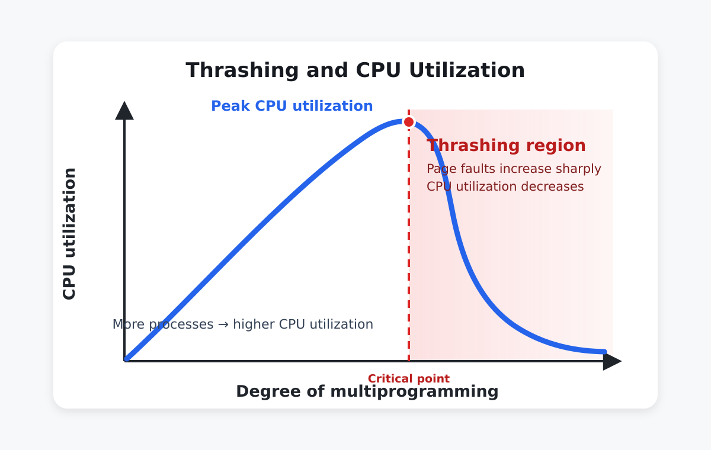

# 快速導覽
讓程式覺得自己有很大的連續記憶體（Virtual Address Space），但實際上只把「目前真的會用到的那部分」放在 RAM。
不夠的時候再把頁面換進換出（paging in/out）。

> Virtual Memory = 用「需求載入（demand paging）」+「頁面置換（page replacement）」來用小 RAM 撐起大程式。

- 為什麼 VM 可行？
    - 因為程式有 locality of reference（只會密集使用一小段頁面）。

- Demand Paging 是怎麼運作的？
    - page table 的 valid/invalid bit + page fault 例外處理流程。

- Page fault 為什麼會讓效能炸掉？
    - 因為牽涉 disk I/O，所以 page fault rate 要非常非常小；會用 EAT（effective access time） 去算。

- 沒有 free frame 時怎麼辦？
    - 用 page replacement，挑 victim page；dirty 的還要先寫回。

- frames 要怎麼分配給 process？
    - 有 minimum frames（不然某些指令會永遠做不完），再來談 equal/proportional/priority、local/global replacement。

- 什麼是 thrashing？怎麼救？
    - 一直在換頁，CPU 利用率反而下降。用 working-set model 或 page-fault frequency (PFF) 控制/暫停部分 process。

---

# BackGround

The Problem - **Wasteful Memory Usage**

## Why Use VM
傳統 : 整個程式載入Memory
- 問題 : 很多當前沒用到的程式
    - Error Handling : 很少觸發，但碼量很大 → 佔 RAM
    - Infrequent Features : 基本用不到的功能 → 佔 RAM
    - Over-Allocated Structures : array/buffer 宣告最大值，但實際只用一小部分 → 佔 RAM

Key Insight：Locality of Reference
- 程式在任何時間點，只會用到位址空間的**一小部分**
    - Temporal locality（時間區域性）：剛用過的，等一下還會用（例如 loop 變數、同一段 code 重複跑）
    - Spatial locality（空間區域性）：用到 A 之後，很可能用到 A 附近（例如陣列連續存取、順序指令）
- 這少部分放在 **working set** 剩下可以放Disk

把 logical (virtual)**address space** 和 **physical address space** 分開。
- 程式使用的是 virtual address（可以很大）
- OS 只把 需要的那部分對應（map）到 RAM
- 沒用到的那部分 留在 disk，等真的用到再載入

## VM 解決 Memory 4 Problem

| Problem                             | VM解法          |
| ------------------------------- | ----------- |
| Unused code         | demand loading  |
| Redundant Libraries | sharing |
| Over-alloc           | 保留很大一段虛擬位址空間，真正碰到那段才給 physical page       |
| Program > RAM          | partial execution (swap in/out)       |

## Virtual Memory Benefits
> 後3個是附加

1. 主要 : **Programs 大小可以 > Physical Memory**
2. Higher Multiprogramming - RAM 可放更多 Process 的 Working Set → CPU/資源利用率更好
3. **Simplified** Programming
4. **Faster** Execution - Less I/O (一開始少I/O 可以更快執行)

## Virtual Memory 缺點
- PageFault 處理會影響效能，記憶體存取效能比實際記憶體差
- 不容易製作，需要大量硬體
  - MMU
  - Hardware bits - valid-invalid bits 、 Modification bits 、 Reference bits 、 Protection Bits
  - Secondary Memory ， 保存不在記憶體中的Process Page

## Implementation
- **Demand Paging**（常見）：固定大小 pages，管理簡單（主流就是它）
- Demand Segmentation（較少）：可變大小 segments，管理複雜

---

# Demand Paging

## 基礎概念

Demand Paging =**「用到才載入」**

Benifits : 
1. Less I/O
2. Less memory per process
3. Large programs

運作 : 
-  CPU 要存取某 page → 查 page table：
    - valid = 1：代表這個 page 在 RAM → 直接存取（hit）
    - valid = 0：代表「不在 RAM / 或不合法」
        - 若是 invalid reference（不合法位址） → OS 終止（abort）
        - 是 合法但尚未載入 → 觸發 page fault（OS 去把 page 載進來）

流程 :
1. Step 1：初始化 process 控制結構
    - 建 PCB、設定 PC、初始化 registers

    - 建 page table：先把 entries 標成 invalid（表示目前沒載入）

2. Step 2：只載入必要頁

    - 只載入「第一個 code page」（包含 entry point 的那頁）

3. Step 3：開始執行

    - CPU 取指令（fetch at PC）

    - 如果要用到的 page 不在 RAM → page fault → OS 把缺的 page 載入
4. Step 4：結束 : Free

## Pure Demand Paging

**一開始 0 個 pages 在 RAM**

流程 : 
1. 放「不在 RAM 的 pages」的地方
2. CPU 抓第一個instruction → page fault → Load code space
3. Access Data →  page fault → Load data page
4. 用到哪載哪

Trade-off :
- Pro（優點）：一開始佔用 RAM 最少
- Con（缺點）：剛開始 page fault 率會很高

但靠 **locality** 快速 warm-up 穩定

## PrePaging
猜測Process初期所需的Pages，並事先載入記憶體中

## Pager v.s Swapper

Pager : 管理 **「單一 page」** 的載入/換出 （demand paging 用它）
Swapper :搬移 **「整個 process」**

Hardware requirements
- Page table valid/invalid bit
    - 1：page 在 memory
    - 0：page 在 disk / 尚未載入

Swap space / backing store / **Secondary Memory** (HDD/NVM Devices)（後備儲存）: 放「不在 RAM 的 pages」的地方

## Page Fault Handling

process 存取某 page 時，發現 **valid bit = 0** → 硬體觸發 **trap** 進 OS

> 原本Vaild-invaild bit 用來判定Page存取是否合法，但在V.M中再多一個區分是否在Memory中

流程 :  
 > trap→驗證→找 frame→從 disk 載→更新表→重啟指令

1. **Trap to OS**

    - 保存狀態（PC、registers）

    - 呼叫 page fault handler

2. **Validate reference**（判斷是不是合法位址）

    - 不合法 → ABORT（segmentation fault）

    - 合法但不在 memory → 繼續處理 (代表是Page Fault引起)

3. **Get free frame**

    - 從 free-frame list 拿

    - 若沒有 → 之後會用 **page replacement**

4. **Load page from disk** : 去 swap space 找到 page，讀進 RAM

5. **Update page table** : 寫入 frame number，並把 valid 設成 1

6. **Restart instruction**

## Free Frame List (沒什麼考)
- 大部分OS會維護一條 Free-Frame-List , a pool of Free Frame來滿足
- 通常用 zero-fill-on-demand，在配置New Frame時，將內容清除乾淨

## Page Replacement
page fault 發生時，如果 沒有 free frames，就必須先「趕走一個 page」

流程 : 
1. 選 victim page（用 replacement algorithm：FIFO/LRU/Clock…）
2. 如果 victim 是 dirty → 先寫回 disk
    > dirty : RAM 內容 ≠ backing store（disk/swap）上的內容

3. 把新 page 從 disk 載入剛空出來的 frame

4. 更新 page tables

    - victim：valid = 0

    - new page：valid = 1
5. restart instruction

Cost :
- Clean victim：1 次 disk read（只要把新 page 讀進來）
- Dirty victim：**1 write** + 1 read（先寫回再讀新頁）

## Demand Paging Performance

EAT 公式 :
$$
EAT = (1-p) * ma + p * pft
$$
> p = page fault rate , ma = memory access time , pft = page fault time

## Why Demand Paging Works

Locality again（空間 + 時間都 **「靠近」**）
- Spatial：存取 X → 很快會用到附近位址（陣列 traversal）
- Temporal：存取 X → 很快又會用到 X（迴圈變數）

Locality 怎麼降低 page faults ? 
- 一次 page fault 載入的是 **「整個 page」**

## page fault 為什麼這麼慢？
Page fault time ，主要分四段
1. Service interrupt：~10µs（0.1%）

2. Find frame & locate page：~100µs（1.2%）

3. Disk I/O：~7.9ms（98.5%）← 超大瓶頸
    - seek + rotation + transfer
4. Restart process：~10µs（0.1%）

> 1,2,4 可壓到幾百條指令 , Disk I/O 最難縮

---

# Process Creation

| 機制                                            | 核心想法（一句話）                                                             | 觸發時機（什麼時候才真的做事）                                                                         | 主要優點                                                                                  | 主要代價 / 注意點                                                       | 
| --------------------------------------------- | --------------------------------------------------------------------- | --------------------------------------------------------------------------------------- | ------------------------------------------------------------------------------------- | ---------------------------------------------------------------- |
| Demand Paging for Process Creation（建立行程也按需載入） | **建立 process 時不把整個程式載入 RAM**，只先載「會馬上用到」的 page| **CPU 執行到尚未載入的 page → page fault → OS 把該 page 從磁碟載入**| 啟動更快、RAM 壓力更小、可同時容納更多 process（提高 multiprogramming）| 會有較多 page fault（尤其剛開始/工作集變動時）；page fault 很貴（牽涉 I/O）| 
| Copy-on-Write（COW）| `fork()` 時先**共享** parent 的 pages，**有人要寫才複製**| `fork()` 後 **第一次寫入某個共享 page → protection fault（常見：write fault）→ OS 複製該 page 給寫入者**| `fork()` 便宜很多；如果 child 很快 `exec()`，幾乎不用真的複製（超省）| 第一次寫入會有額外成本；需要頁面保護/引用計數等機制；寫很多時最後仍可能接近「全拷貝」成本| 
| Memory-Mapped Files（MMF / mmap）| 把**檔案內容映射成一段 virtual memory**，像存取陣列一樣讀寫檔案| **第一次碰到某段檔案對應的 page → page fault → OS 把檔案那段讀進 page cache / 記憶體**；寫入通常也會變成「Dirty」之後再回寫 | 少很多 `read()/write()` 系統呼叫；OS 可用 page cache 做快取；支援 shared mapping（多 process 共享同一份檔案資料） | 需要處理一致性/同步；SIGBUS/檔案截斷等邊界情況；不小心會變成隱性大量 page fault | 

> COW 簡單說就是 只複製有改動的地方 ， 令 Page A,B,C ，Process 改 Page C ，那就複製一個出來給他 ，其他共用。

---

# Page Replacement
觸發情境：page fault + 沒有 free frames

Two solution :
- Option 1：Swap out entire process（把整個行程換出去）
    - 做法：挑一個 victim process，把它所有 frames 都釋放
    - 缺點：一次釋放很多 frame 沒錯，但你把一個 process 直接踢走 → multiprogramming degree 下降
- Option 2：Page replacement
    - 做法：只踢掉 一個 page（或少量 pages）來空出 frame
    - 優點：仍然維持多行程程度（multiprogramming level）
    > 這裡提到 dirty bit：想省成本就「偏好換掉 clean page」，因為 dirty page 換出前要先寫回 disk（多一次 I/O），沒被修改過的Page就不用SWAP-OUT
    > Note : 此Bits是由 **MMU**:set 0->1;OS:reference(read)及Reset(1->0)
- Frame allocation algorithm：**每個 process 分到幾個 frames**？
    - 少 → page fault rate 高 → thrashing
    - 太多 → 記憶體浪費、同時能放的 process 變少（multiprogramming 降）

page fault 流程 = 找 disk 位置 → 找 frame（沒就 replacement：選victim/dirty寫回/改PTE invalid）→ 讀入 → 更新 page+frame table → 重啟指令。

## Page Replacement Algorithms

Goal：**最小化 page fault rate** → **減少 disk I/O** → 整體效能更好

Time-based Algorithm
- FIFO：最早進來的先出去（oldest page）
- Optimal (OPT/MIN)：換掉「未來最久才會再被用到」的 page
- LRU：換掉「最久沒被用到」的 page

Frequency-based
- LFU：換掉「被存取次數最少」的 page
- MFU：換掉「被存取次數最多」的 page

## FIFO
換掉**最早被載入**記憶體的 page（oldest）

怎麼做 : 
- 用一個 queue 記錄「進來順序」
- page fault 且要換頁：
    - 踢掉 queue front（最老）
    - 新 page 放 queue rear（最新）

## FIFO 的 Belady’s Anomaly

直覺 vs 現實
- 直覺：frames 更多 → page faults 應該更少 ✅
- FIFO 現實：frames 更多 → page faults 反而更多 ❌
這個反直覺現象叫 Belady’s anomaly。

為什麼會發生？
- 因為 FIFO 不保證「frames 變多時，記憶體裡的 pages 集合是包含關係」。
    多一個 frame 會改變「老舊順序」，可能害你把之後需要的頁踢掉。

## OPT / MIN Algorithm
換掉 **「未來最久才會再被用到」** 的那個 page
需要「知道未來」→ 現實做不到

## LRU（Least Recently Used）
OPT 看未來（forward）不可能

LRU 改成看過去（backward）：**換掉最久沒被用的 page**

LRU 怎麼實作 :
- 方法1：Counter / Timestamp
    - 每次 access：更新該 page 的 timestamp
    - 要換頁：找 timestamp 最小的（最久以前）
    - 成本：更新 O(1)，但找最小值要 O(n) → **太慢**
- 方法2：Stack（雙向鏈結串列）
    - 每次 access：把該 page 移到串列最上面（MRU）
    - 換頁：直接拿最下面（LRU）
    - 若有 hash table 做 page→node 查找：
        - 更新可接近 O(1)，換頁 **O(1)**
    - 但問題是：每次 memory access 都要動資料結構 → **overhead 太大**

## Stack Algorithms
n frames 時在 memory 的 pages 集合，一定是 (n+1 frames) 的子集合
也就是：Pages(n) ⊆ Pages(n+1)

> Stack algorithms 不會有 Belady’s anomaly
> OPT 和 LRU 都是 stack algorithm
> FIFO 不是，所以會 anomaly。

## LRU Approximation：Reference Bit
True LRU 要「每次存取都更新資料結構」→ 太貴

解法：用硬體的 Reference bit（R-bit）
- 每個 page 有 R bit
- 初始 R=0

- page 被存取時：硬體自動設 R=1

- OS 週期性把 R 清回 0
    - R=1 表示「最近被用過」
    - R=0 表示「最近沒用」

## LRU Approximation 的三個演算法
**Additional-Reference-Bits**
- 用「多個 bit」記錄一段時間的 history（像移位暫存器）
- bits 越多越像 LRU，但成本也更高（需要更多記憶體/維護）

**Second-Chance / Clock algorithhm**
- 用單一 R bit
- 概念：FIFO + second chance
    - 看到某 page 若 R=1：給它一次機會 → 把 R 清成 0、指標往下
    - 若 R=0：就換掉它
- 最常見、CP值最好

**Enhanced Second-Chance**
- 用 (R bit + dirty bit)
- 優先換掉「(R=0, dirty=0)」這種：最近沒用且乾淨（不用寫回）
- I/O 效能更好

## Frequency-Based (不常用)

用 **「頻率」**不是「最近性」

LFU：換掉 count 最小（最少用）

MFU：換掉 count 最大（最常用）

##  Page-Buffering Algorithms
選出Victim Page且Modification bit = 1時
1. 先將victim Page Swap out to Disk
2. Load Desired page
- 這會導致Restart 拖得很長

### 方法一 : OS keeps a free frame pool
- 當P.F. 且 選出victim Frame 後，OS 先選一 Free Frame Pool，**先讓Desired Page載入**
- 可以立即執行，之後再把victim 寫回Disk，寫回後victime Frame -> Free Frame Pool

### 方法二 : keep a list of modified pages
- 維護一條modified pages 的串列，一旦paging device is **idle**，OS 就挑出一些寫回DISK

### 方法三 : OS keeps a free frame pool ， 還有記錄這些Free Frame內置放的是哪些Pages，
- free 代表「OS 已經不把這個 frame 分配給任何 process 使用」；不代表裡面的 bit 會立刻被清成 0。
- 所以放的一定是**最新的**
- P.F. OS 先去Free Frame Pool中檢查是否能找的到the Desired Page，如果有找到就直接取用此Frame，無須任何I/O
- 如果沒有就做前面的作法即可

## Global / Local Replacement

### Global 
可以從**其他Processes**選擇Frame
- 優點 : memory utilization 較佳，thoughtput 較佳
- 缺點 : 會受到其他Processes 影響

### Local 
OS限定只能從**Page Fault Process 的 Frame** 選擇犧牲的Frame

## 總結表格

| 演算法                   | 替換規則（踢誰）                      | 需要硬體/資料結構                  | 優點                   | 缺點/考點                     | 是否可能 Belady anomaly            | 投影片例子 faults               |
| --------------------- | ----------------------------- | -------------------------- | -------------------- | ------------------------- | ------------------------------ | -------------------------- |
| FIFO                  | 踢最老（最早進來）                     | Queue                      | 超簡單                  | 不看 locality，可能踢掉常用頁       | **會**                          | 3 frames → 9；4 frames → 10 |
| OPT / MIN             | 踢「未來最久才用」                     | 需要未來資訊（不可實作）               | 理論最佳（下界）             | 實務做不到，只能比較                | **不會**（stack)                  | 4 frames → 6               |
| LRU                   | 踢「最久沒用」                       | 追蹤 recency（昂貴）             | locality 很合理，常近似 OPT | True LRU 成本高 → 需近似        | **不會**（stack)                  | 4 frames → 8               |
| Clock / Second chance | FIFO + R bit：R=1 給一次機會，R=0 才踢 | 1-bit R + circular pointer | CP值最高，常用             | 只是近似 LRU                  | 通常不會像 FIFO 那麼糟（課本常視為 stack 近似） | （投影片未給數）                   |
| Enhanced Clock        | 按 (R,dirty) 類別優先踢 (0,0)       | R bit + dirty bit          | 少寫回，I/O 更好           | 複雜一點                      | 同上                             | —                          |
| LFU                   | 踢 count 最小                    | counter                    | 直覺：常用留著              | phase change 容易失準；需 aging | 不一定                            | —                          |
| MFU                   | 踢 count 最大                    | counter                    | 另一種假設（最小可能剛進來）       | 多數情況不穩、少用                 | 不一定                            | —                          |

LRU 實作方法比較

| 方法                  | 怎麼做                              | Access 成本 | 換頁時找 victim 成本 | 問題                          |
| ------------------- | -------------------------------- | --------: | -------------: | --------------------------- |
| Timestamp / Counter | 每次存取更新 timestamp；換頁找最小 timestamp |      O(1) |           O(n) | 換頁要線性掃描，太慢                  |
| Stack（雙向鏈結串列）+ Hash | 存取就把頁移到最上（MRU）；換頁拿最下（LRU）        |     O(1)* |           O(1) | **每次存取都要維護資料結構**，overhead 大 |

Stack algorithm 性質

| 名詞              | 定義/性質                                         | 重要結論                   | 例子      |
| --------------- | --------------------------------------------- | ---------------------- | ------- |
| Stack algorithm | Pages(n) ⊆ Pages(n+1)（n frames 的集合是 n+1 的子集合） | **不會有 Belady anomaly** | OPT、LRU |

LRU Approximation

| 方法                        | 用哪些 bits      | 核心概念                            | 優點                  | 缺點            |
| ------------------------- | ------------- | ------------------------------- | ------------------- | ------------- |
| Reference bit 機制          | R             | 硬體存取自動設 R=1；OS 定期清 0            | 幾乎無 per-access 軟體成本 | 只有「最近/不最近」粗資訊 |
| Additional-reference-bits | 多個 R（history） | 用多bit記錄一段時間存取歷史                 | 更像 LRU              | bits越多成本越高    |
| Second-chance / Clock     | R             | FIFO + second chance（R=1 先放過一次） | 最常見、平衡好             | 近似，不是精準 LRU   |
| Enhanced Clock            | R + dirty     | 先踢 (R=0,dirty=0)                | 少寫回、I/O佳            | 複雜些           |

---

# Allocation of Frames

OS 在做 frame allocation（分配實體記憶體 frames）時要決定： **每個 process 應該拿到多少 frames？**

重要限制：每個 process 都 **「至少」需要一個最小 frames 數**

如果 frames 太少會怎樣？
- 可能 Page A , Page B 互相把對方推擠掉
- 同一條指令執行過程就無限 fault

解法 : 
- **分配「足夠 frames」**給每個 process。

## Frame Allocation Strategies
把有限的 frames 分配到各 processes

方法 : 
1. Fixed allocation schemes（固定分配）
    - Equal allocation（平均分）
    - Proportional allocation（按大小比例分）
2. Priority allocation（按優先權分）
    - 不看大小，改看 priority（重要的 process 給更多）
        - Priority-based proportional allocation：分配時就把 priority 納入比例
        - Priority-based replacement：高 priority process page fault 時，允許它 **「從低 priority process 那裡拿 frame」**

## 可以怎麼選 ? Local vs Global Replacement

Local replacement（只從自己 frames 挑）
- victim 只能是 **「這個 process 已分到的 frames」**之一
- 可以**    ** 現象在自己的Process
- 優點： 可預測、隔離（別人不會搶你的 frame）

- 缺點： 不靈活、可能效率差（有的 process 明明很需要，但不能借別人的）

Global replacement（可以從全系統 frames 挑）**(常用)**
- victim 可以從 **「任何 process 的 frames」**挑
- 優點： **效率好**、彈性高、吞吐量高
- 缺點： 
    - 不可預測：你可能突然被別人搶 frame
    - thrashing 可能擴散：某個 process 狂 fault，可能把別人也搞到 fault 增加

---

# Thrashing

Thrashing = 花的時間在Paging比執行時間多

可能導致原因 :
- Process **frames 不夠** → 無法同時把「正在用的那群 pages」留在 RAM。
- 也就是 **無法容納 working set** → 造成幾乎每次存取都 page fault。

Characteristics :
- **Excessive paging activity**：換頁爆量
- **Performance collapse**：效能崩壞

>  Thrashing = 換頁比做事還多；根因是 frames 不足以裝下 working set，會造成效能崩盤。

## Thrashing: The Performance Collapse Cycle

特別容易出現在 **Global page replacement policy**（全域替換）下

**Progression to Thrashing** :
1. frames 足夠 → 正常執行
2. frames 減少 → page faults 增加
3. 低於門檻 → 幾乎每次存取都 fault
4. thrashing → process 幾乎沒進度（no forward progress）

**System-wide Impact**（會「傳染」）:
- 一個 thrashing process 可能引發全系統 thrashing：
  - 大家都在等 I/O → CPU usage 看起來很低
  - OS 可能誤判「CPU 很閒」→ **admit 更多 processes**
  - processes 更多 → frames 更少 → faults 更高 → **cascade effect**

Thrashing Spiral（惡性循環 8 步）
1. Process 開始 page fault
2. I/O queue 增長（等待換頁）
3. CPU utilization 下降（process **blocked on I/O**）
4. OS 誤判：**CPU 低** → **需要更多 process**
5. Admit 更多 process（multiprogramming degree ↑）
6. frames 競爭加劇（新 process 搶 frames）
7. faults 連鎖上升（大家 fault 更頻繁）
8. 系統崩潰：CPU utilization → 接近 0

## Thrashing 解決方法

### Decrease Multiprogramming degree
降低Multiprogramming degree

### Prevention Strategies
- 必須讓每個 process 有足夠 frames：
  - **Working-Set Model**
  - **Page-Fault Frequency (PFF)**

### Working-Set Model
>Working set 用來近似真正 locality

Locality of Reference（區域性）: 
- 程式會以「階段（phases）」方式使用**少量 pages**：
  - function 呼叫 → code locality 改變
  - data iteration → data locality 改變
- Locality model 定義 : 具有某種局部集中存取的特性
    - Temporal locality model : 目前所存取的記憶體區域，**過不久又要存取** (for、while)
    - Spatial locality model : 目前所存取的記憶體區域，其**鄰近的區域也可能被立即存取** (array)

> if Program 中之指令Data Structure Algo等符合"Locality Model"有助於降低PFR，反之則為"**BAD**"
> **BAD**例子，link-list、Hashing、goto jump、Binary Search、Indirect Addressing Mode

Model Components（定義）:
- **Δ（Delta）**：視窗大小（時間或 references 數量）
- **WS(t, Δ)**：在視窗區間 **[t − Δ, t]** 內被參考過的 pages 集合
- **|WS|**：working set size（集合大小）≈ process 需要的 frames 數

- **Δ 的選擇很關鍵**：
  - Δ 太小 → 低估需求
  - Δ 太大 → 高估需求（把過去用過但已不需要的也算進來）

運作 : 
- Ex1 : 2 6 1 5 7 7 7 7 5 1
    - WS(t1) = {1,2,5,6,7}
- Ex2 : 3 4 4 3 4 3 4 4 4 4
    - WS(t2) = {3,4}
    
> 程式不同時間進入不同 phase → 使用的 pages 群組會改變（locality shift）。

### Working-Set Model for Thrashing Prevention : 

Core Strategy（核心量）:
- **WSSᵢ**：process i 的 working set size（需要 frames）
- **D = Σ WSSᵢ**：全系統總 frames 需求（total demand）
- **m**：可用實體 frames 總量

Decision Framework（決策）
- **D > m**：需求 > 供給 → 系統會 thrash  
  → 必須 **suspend / swap out** 一些 process（降低 multiprogramming degree）
- **D ≈ m**：接近最佳狀態（高利用、低 thrash）
- **D << m**：記憶體閒置 → 可 admit 新 process 或喚回 suspended process

OS Implementation
- 持續追蹤每個 process 的 WSS
- 分配 frames 保證 WSS
- 透過 suspend / admit 調整多工度

### Working-Set Model：優缺點

Advantages（優點）:
1. 避免 thrashing（確保足夠 frames）
2. 最大化 multiprogramming（不 thrash 前提下跑最多）
3. 最佳化 CPU utilization（平衡記憶體壓力與吞吐）
4. 自適應（working set 改變可調整）

Disadvantages（缺點）:
1. **高 overhead**：追蹤 page references 很貴
2. 實作複雜：每個 process 維護滑動視窗
3. Δ 不好決定（估計誤差風險）
4. 需維護 reference history（儲存成本）

Practical Approximations（實務近似）
- 參考位元（reference bits）+ 週期掃描
- 用 page fault frequency 估 WSS
- 抽樣（sampling）取代全面監控

### Page-Fault Frequency (PFF) Scheme（直接盯 fault rate）

核心概念 : 
- 直接監控每個 process 的 **page-fault rate**，
- 透過動態調整 frames 來避免 thrashing。

Control Parameters（門檻）
- **PFFmax**：最大可接受 fault rate（太高代表快 thrash）
- **PFFmin**：太低代表 frames 過多（可回收）
- 目標區間：**PFFmin ≤ fault rate ≤ PFFmax**

Control Algorithm（控制規則）
- 若 **PFF > PFFmax**：
  - process 需要更多 frames → **allocate frames**
  - 若沒有 free frames → **suspend process**
- 若 **PFF < PFFmin**：
  - process frames 過多 → **reclaim frames** 加回 free pool
- 若在區間內：
  - **no action**

### PFF 圖（fault rate vs number of frames）

直覺 : 
- frames ↑ → fault rate ↓（通常是下降曲線）
- 高於 upper bound（PFFmax）→ 增加 frames
- 低於 lower bound（PFFmin）→ 減少 frames

### Working Sets & Page Fault Rates: Dynamic Relationship（WS 與 fault rate 的動態關係）

Memory locality 的時間變化 : 
- **Stable working set** → fault rate 低且穩定
- **Locality shift begins**（進入新 phase）→ 需要載入新 pages → fault rate 上升
- **Fault rate spikes** → 逐步建立新的 working set
- **Peak fault rate**（最大 churn）
- **New WS established** → fault rate 下降並穩定在新的 baseline

## 甚麼能改善 Thrashing

| #  | 方法                                     | 判斷              | 原因                                                      |
| -- | -------------------------------------- | --------------- | ------------------------------------------------------- |
| 1  | Decreasing the multiprogramming degree | ✅ **Will**      | Process 變少，每個 Process 可分到更多 Frames                      |
| 2  | Increase the multiprogramming degree   | ❌ **Not**       | Process 變多，每個 Process 可用 Frames 更少，Thrashing 更嚴重        |
| 3  | Install more main memory               | ✅ **Will**      | RAM 增加 → Frames 增加 → Working Set 更容易放得下                 |
| 4  | Install faster CPU                     | ❌ **Not**       | Thrashing 的瓶頸是 Page Fault / Paging I/O，不是 CPU           |
| 5  | Install faster paging I/O disk         | 🟡 **Probably** | Page Fault 處理更快，但 Page Fault 數量未必減少                     |
| 6  | Install bigger paging disk             | ❌ **Not**       | Swap 空間變大，但 Physical Memory Frames 沒增加                  |
| 7  | Reduce the page size                   | ❌ **Not**       | Page 變小後，同樣資料會被切成更多 Pages，可能增加 Page Fault               |
| 8  | Increase the page size                 | ✅ **Will**      | 一次載入更多相鄰資料，可利用 Spatial Locality                         |
| 9  | Reduce the main memory size            | ❌ **Not**       | RAM 變少 → Frames 變少 → 更容易 Thrashing                      |
| 10 | Using the local replacement policy     | 🟡 **Probably** | Thrashing Process 只能換自己的 Page，不容易影響其他 Process           |
| 11 | Using the global replacement policy    | ❌ **Not**       | Thrashing Process 可能搶其他 Process 的 Frames，造成連鎖 Thrashing |
| 12 | Using the prepaging technique          | 🟡 **Probably** | 如果預測準，可以先載入之後會用到的 Page，降低 Page Fault                    |

# Virtual Memory 補充議題

## Copy-on-Write（COW）

### 傳統 `fork()` without Copy-on-Write

- Child Process 建立時，Kernel 會：
  1. 配置一份新的 Memory Space 給 Child
  2. 將 Parent 的內容全部複製給 Child
- 缺點：
  - Memory 需求大
  - Child 建立速度較慢
  - 如果 Child 馬上執行 `exec()`，前面的複製幾乎都浪費掉

### `fork()` with Copy-on-Write

- Child 建立時，先與 Parent **共用相同的 Pages**
- 這些 Pages 會被標記為不可直接修改
- 當 Parent 或 Child 要修改某個 Page 時：
  1. 發生 Write
  2. OS 複製該 Page 到新的 Frame
  3. 修改者使用新的 Page
  4. 另一方繼續使用原本的 Page

**流程：**

Parent／Child 共用 Page → 有人 Write → Copy Page → 各自擁有 Page

### 優點

- 減少不必要的 Memory Copy
- 節省 Memory
- 加快 `fork()` 速度

---

## Allocating Kernel Memory

Kernel Memory 的配置方式與一般 User Process 不太一樣。

### Kernel Memory 特性

- Kernel Data Structure **大小不一定**
- 所需 Memory 大小會變動
- 某些 Hardware Device 需要 **Physically Contiguous Memory**(因為有一些大小遠小於一個Page)
- 因此 Kernel Memory 需要特殊的配置方法

### 兩種方法

1. **Buddy System**
2. **Slab Allocation**

## Buddy System

### Buddy System 基本概念

Buddy System 以 $2^k$ 大小的區塊配置 Memory。

假設：

- Available Memory = `256 KB`
- Request = `21 KB`

因為：

- `21 KB > 16 KB`
- `21 KB ≤ 32 KB`

所以必須配置 **32 KB**。

#### 切割過程

256 KB  
→ 128 KB + 128 KB  
→ 64 KB + 64 KB  
→ 32 KB + 32 KB  
→ 取其中一個 32 KB 給 Request

因此會浪費：

$$
32-21=11\text{ KB}
$$

這 11 KB 屬於 **Internal Fragmentation**。

### 4. Buddy 合併條件

Memory 被釋放時，不是只要兩塊一樣大就能合併，必須同時符合：

1. **大小相同**
2. **兩塊互為 Buddy**
3. **兩塊都是 Free**

#### Buddy 判斷

若兩個區塊的起始位址為 $X$、$Y$，大小皆為 $2^k$，則：

$$
X\oplus 2^k=Y
$$

或：

$$
Y\oplus 2^k=X
$$

表示兩者互為 Buddy。

### 例子

兩個大小皆為 4 的區塊，起始位址分別是 0 和 4：

$$
0\oplus4=4
$$

所以兩者互為 Buddy。

---

### Buddy System 優缺點

#### 優點

- 分配速度快
- 回收速度快
- Buddy 為 Free 時，可以快速合併成較大的 Chunk

#### 缺點

- 會產生 **Internal Fragmentation**
- 原因是只能配置 $2^k$ 大小的區塊

例如 Request 21 KB，實際必須配置 32 KB。

---

## Slab Allocation

### Slab Allocation 基本概念

Slab Allocation 主要用來配置 **Kernel Objects**，例如：

- Process Descriptor
- Semaphore
- File Object
- Kernel Data Structure

### 基本結構

**Cache → Slab → Objects**

#### Slab

一個 Slab 由>=`1`個 **Physically Contiguous Pages／Frames** 組成。

#### Cache

一個 Cache >= `1`個 Slabs。

#### Object

每一種 Kernel Data Structure 都有自己對應的 Cache。

例如：

Process Descriptor  
→ Process Descriptor Cache  
→ Slab  
→ Process Descriptor Objects

另一種：

Semaphore  
→ Semaphore Cache  
→ Slab  
→ Semaphore Objects

---

## Slab Allocation 運作方式

Cache 建立時，會先建立一批 Objects。

- 一開始：Object = Free
- Kernel 需要 Object：Free Object → Used Object
- 使用完畢：Used Object → Free Object

Object 不會立刻被刪除，而是留在 Cache 中，等待下一次使用。

---

## Slab Example

假設：

- Slab Size = `12 KB`
- Page Size = `4 KB`
- Object Size = `2 KB`

則：

$$
1\text{ Slab}=\frac{12}{4}=3\text{ Pages}
$$

而且：

$$
\frac{12}{2}=6
$$

所以一個 Slab 可以存放 **6 個 Objects**。

---

## Slab Allocation 優點

### ① 減少 Fragmentation (沒有內部碎裂也沒有外部碎裂)
- 每種 Kernel Object 都有專屬的 Cache
- 每個 Cache **對應固定大小的 Kernel Object**
- Allocator 可以提供適合該 Object 大小的 Memory

### ② 配置速度快

- Objects 已經事先建立
- Kernel 需要時，直接取得 Free Object
- 使用完只要將狀態改回 Free

**Free → Used → Free**

### 使用 Slab Allocation 的 OS

- Solaris
- Linux

---

## Page Size

### Page Size 對系統的影響

#### Page Size 小的缺點

##### ① Page Fault 可能增加

同一個程式會被切成更多 Pages，因此執行時可能需要載入更多不同的 Pages。

##### ② Page Table 變大

Page Size ↓  
→ Page 數量 ↑  
→ Page Table Entry 數量 ↑  
→ Page Table Size ↑

##### ③ I/O 次數增加

Page 越小，一樣大小的資料需要分成更多 Pages 傳輸，因此可能需要更多次 Page I/O。

#### Page Size 小的優點

##### ① Internal Fragmentation 減少

Page Size ↓ → 最後一個 Page 未使用的空間通常 ↓

##### ② 單次 I/O Latency 可能降低

一次傳輸的資料較少，因此單次 I/O Transfer Time 較短。

##### ③ Locality 更精準

只載入真正需要的附近資料，較不容易載入大量沒有用到的內容。

---

## Page Size Trade-off

| Page Size 小 | Page Size 大 |
|---|---|
| Page Table 大 | Page Table 小 |
| Page Fault 可能較多 | Page Fault 可能較少 |
| I/O 次數較多 | I/O 次數較少 |
| Internal Fragmentation 小 | Internal Fragmentation 大 |
| 單次 I/O Transfer Time 較短 | 單次 I/O Transfer Time 較長 |
| Locality 較精準 | 可能載入更多不需要的資料 |

因此 Page Size 是各種因素之間的 **Trade-off**。

---

## TLB Reach

### TLB Reach 定義

TLB Reach 是：

> 經由 TLB 所能直接涵蓋的記憶體範圍。

公式：

$$
\boxed{\text{TLB Reach}=\text{TLB Entries}\times\text{Page Size}}
$$

#### Example

假設：

- TLB Entries = `64`
- Page Size = `4 KB`

則：

$$
64\times4\text{ KB}=256\text{ KB}
$$

所以 TLB Reach = **256 KB**。

---

### 如何增加 TLB Reach

#### 方法 1：增加 TLB Entries

TLB Entries ↑ → TLB Reach ↑

缺點：Hardware Cost 較高。

#### 方法 2：增加 Page Size

Page Size ↑ → TLB Reach ↑

缺點：Internal Fragmentation 增加。

#### 方法 3：Multiple Page Sizes

系統同時支援：

- Small Pages
- Large Pages

讓需要涵蓋較大 Memory Range 的程式使用 Large Pages。

優點：

- 增加 TLB Reach
- 不必讓所有 Pages 都變大

---

## Program Structure

### Program Structure 對 Page Fault 的影響

程式的下列設計都可能影響 Page Fault：

- 指令敘述
- Data Structure
- Algorithm
- Memory Access Pattern

如果符合 **Locality Model**：

Page Fault Ratio ↓  
→ Virtual Memory Performance ↑ : **GOOD**，反之則為 **BAD**

---

## Array Page Fault Example

### Row-Major

假設有：`int data[128][128];`

而且 Array 使用 **Row-Major** 儲存，Memory 中的順序為：

`data[0][0]` → `data[0][1]` → … → `data[0][127]`  
→ `data[1][0]` → `data[1][1]` → …

也就是：**Row 0 → Row 1 → Row 2 → …**

---

### 好的 Access Order

迴圈順序：

- 外層：`i = 0` 到 `127`
- 內層：`j = 0` 到 `127`
- 每次執行：`data[i][j] = 0`

存取順序：

`data[0][0]` → `data[0][1]` → … → `data[0][127]`  
→ `data[1][0]` → `data[1][1]` → …

這與 Row-Major 的 Memory Layout 相同，因此具有良好的 **Spatial Locality**，Page Fault 較少。

---

### 不好的 Access Order

迴圈順序：

- 外層：`j = 0` 到 `127`
- 內層：`i = 0` 到 `127`
- 每次執行：`data[i][j] = 0`

存取順序：

`data[0][0]` → `data[1][0]` → `data[2][0]` → …  
→ `data[0][1]` → `data[1][1]` → …

每次都會跨到下一個 Row。如果不同 Row 分散在不同 Page，就容易產生大量 **Page Fault**。

---

## I/O Interlock

### I/O Interlock 定義

某些 Pages 正在進行 I/O 時，必須被 **Locked／Pinned in Memory**，不能被 Swap Out，直到 I/O 完成後才能 Unlock。

---

### 為什麼需要 Lock？

假設 Device 正在將資料寫入 Page A：

1. I/O 尚未完成
2. OS 將 Page A Swap Out
3. Page A 原本使用的 Physical Frame 被分配給其他 Page
4. Device 繼續向原本的 Frame 寫入資料
5. 資料可能被寫入錯誤的位置

因此正確流程為：

**I/O Start → Lock Page → Perform I/O → I/O Complete → Unlock Page**

#### 核心

> 正在進行 I/O 的 Page 不能被 Page Replacement Algorithm 換出去。

---

> 只能說現在 1:40 作者我要陣亡了