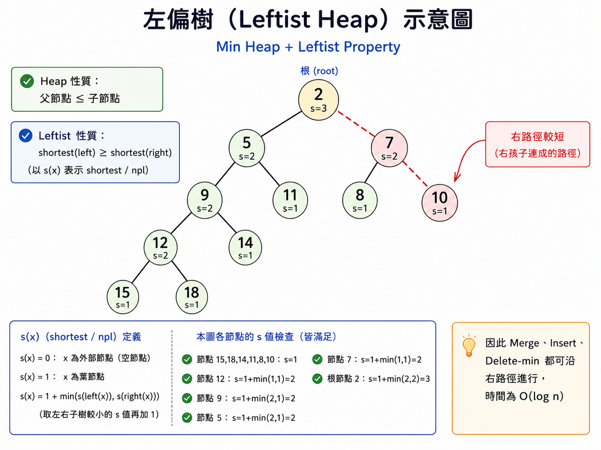

# Double-Ended Priority Queue
| Operation |Time Complexity|
|---|---|
|Insert x |O(log n)|
|Delete-Min|O(log n)|
|Delete-MAX|O(log n)|
|Find min or MAX|O(1)|

- Double Priority Queue 
    - Insert(x)：插入任意元素
    - Delete-Max：刪除最大值
    - Delete-Min：刪除最小值

## min-Max Heap
- **complete Binary Tree**
- 每層交替 min level -> MAX -> min -> MAX -> ...
    - min 是整個 subtree 裡最小的
    - MAX 是整個 subtree 裡最大的

### insertion 
- `x` 置放於last node之後
- 令 `x` 父點為 `p`
    - P 位於 min :
    ```
    // 若插入點在 max 層，即代表父親位於 min 層
    if(x<H[p]){ // x 若比父點小
        H[n] = H[p]; // 把父親往下拉
        verifyMin(x); // 讓 x 去往上挑戰 min
    }else{ // x 比父點大
        verifyMax(x); // 讓 x 去往上挑戰 max
    }
    ```
    - P 位於 MAX :
    ```
    // 若插入點在 min 層，即代表父親位於 max 層
    if(x>H[p]){ // x 若比父點大
        H[n] = H[p]; // 把父親往下拉
        verifyMax(x); // 讓 x 去往上挑戰 max
    }else{ // x 比父點小
        verifyMin(x); // 讓 x 去往上挑戰 min
    }
    ```
### delete

1. 先將 Root 移除
2. 令 X = last node
3. 第三步驟會分為 3 個 cases，準備插入 Root 為空之 Min-Max Heap
    - Case 1 : root 以下沒子點，x 置入 root
    - Case 2 : root 以下左右子點為 Min 的話，令 k = min，k 置入 root，x 放入 k
    - Case 3 : min 位於 root 的子孫的左右子點，令 k = min，令 p = k 的 parent
## Deap(Double-ended Heap)
1. Root 沒有 **element**
2. 左子樹是**min-heap**
3. 右子樹是**MAX-heap**
- 左右有「對稱 partner」
4. 對稱的兩個位置要滿足 : 左邊 ≤ 右邊
- 所以最小值一定在： D[2] ，也就是**左子樹 root**。
>如果真正的對應 node 不存在，就找它的 parent 當 partner。

### Insert x
`x`置於last node

Case 1 : x在min-heap
```c++
// CASE 1 若為插入左子樹，也就是新點在min heap
if(x > deap[j]){ // 若插入元素右子樹相對應j還要大 (4)主要為了第4點
    deap[n] = deap[j]; // 將j之元素換到左子樹
    insert_max_heap(deap,j,x); // 將x依照**max_heap之插入操作**，插入右子樹j之位置
}else{ // 若較小則x仍在左子樹
    insert_max_heap(deap,n,x); // 將x依照min_heap之插入操作，插入最後位置 
}
```
Case 2 : x在MAX-heap
```cpp
// CASE 2  若為插入右子樹，也就是新點在max heap中
if(x < deap[j]){
	deap[n] = deap[j];
	insert_min_heap(deap,j,x);
}esle{
	insert_max_heap(deap,n,x);
}
```
### Delete Min（特別注意）

1. 移走左子樹的 Root，也就是 **Min**。

2. 刪除 Last Node，並令其值為 `x`。
   - `x` 先拿在手上，**不要直接補進洞裡**。

3. 左子樹出現空缺後，讓洞一路往下：
   - 每次選兩個 child 中 **較小的那個往上補**。
   - 子點留下的新空缺，再繼續用其較小的 child 往上補。
   - 一直到最後在 Leaf 留下一個空缺位置 `i`。

   時間複雜度：

   $$
   O(\log n)
   $$

4. 對位置 `i` 執行 `DeapInsertion(D, i, x)`：

   - 找 `i` 在 Max Heap 的 **Corresponding Node**，假設其值為 `y`。
   - 比較 `x` 與 `y`。

   若：

   $$
   x \le y
   $$

   則：

   ```text
   x → 直接放入 Min side 的空缺 i
   ```

   若：

   $$
   x > y
   $$

   則：

   ```text
   y → 放入 Min side 的空缺 i
   x → 放到 Max side
   ```

   並在 Max Heap 中做向上調整，使其仍符合 Max Heap。

---
## SMMH(Symmetric Min-MAX Heap)
> 他能夠快速地找到最大最小

- 為一個 Completed B.T 且 root 不存資料，則滿足以下 3 個 path
1. left sibling <= right sibling **(同一個爸爸的兩個子點)**
2. 如果 node `x` 有祖父，則祖父的**左子點**必定 <= X
3. 如果 node `x` 有祖父，則祖父的**右子點**必定 >= X
- 代表T[2] 為**最小**，T[3]為**最大**
> 祖父左 <= node x <= 祖父右

### Insert X
先放置到 Last node 下一個
- Repeat :
    - check p1 : 不符合 ， 左右互換
    - check p2 向上調整
    - check p3 斜上調整
- 直到滿足

### Delete min 
- 刪除左子Root，形成空格`E`
- 將最後一node刪除，暫時放置於 `E`
- 持續檢查 P1、P2 ， P3 不用 (因為只是刪除min 不會影響P3)

# Extended Binary Tree
- External node : NULL 的地方補上的特殊node 
- Internal node : 原本Binary Tree裡的node
## **External node = Internal node + 1**
- Edge = 2I
- 總node = E + I => Edge = (E + I) - 1
- I = E - 1 => E = I + 1
> E0 = E2 + 1 

## Internal/External Path
Internal Path Length：I(T) => 把所有 internal nodes 的 depth 加起來。
External Path Length：E(T) => 把 Extended Binary Tree 中所有 external nodes 的 depth 加起來。

## E(L)=I(L) + 2n
- n = internal nodes 數量	​
假設 internal node 的 depth 是 d，那它兩個 **child 的 depth 總和是：2d + 2**
所有 internal node 的 depth 總和就是 I => ∑2d=2I
而每個 internal node 又多貢獻 2，總共有 n 個：2n
因此：所有 child 的 depth 總和=2I+2n
I+E=2I+2n => E=I+2n

# WEPL：Weighted External Path Length
現在每個 external node 有一個權重 pi。
$$
WEPL = \sum p_i \times depth_i
$$
> 權重 × 從 root 到它的距離，全部加起來

- 權重大的要放靠近 Root
- Tree height 越小，不見得 WEPL 越小
# Huffman Algorithm
**建立 WEPL 最小的 binary tree**
## 方法
方法非常固定：
1. 每次找出目前 最小的兩個 weight
2. 把它們合併成一棵 tree
3. 新 root 的 weight = 兩個 weight 相加
4. 把新的 weight 放回去
5. 重複直到剩下一棵 tree
> Huffman tree 一定是strict binary tree

## 應用
1. n 個Runs之最佳合併方式
2. **n 個 message 傳輸 with probability 之最佳編碼/解碼方法 (平均Encoding bits最小/最大)**

## Huffman Coding
### Prefix Code 是什麼？
Prefix code 的條件：任何一個 message 的 code，都不能是另一個 message code 的前綴。
## 兩個重要特性
1. **Optimal Prefix Code**
Huffman Code 是一種 Prefix Code，而且它會讓：**Cost 達到最小**。
2. **Variable Length Code**
每個 message 的 code 長度不一定相同
## 特殊情況
若最大加權值 < 最小加權值 × 2
且有 $n=2^k$ 個 messages
使用 Huffman Coding
則每個 message 都會是 $k$ bits。
> 因為如果比較大 ex 2,2,3,3 ，2,2合併完會用3,3不會用4

# Greedy
**Greedy 最大特色：不回頭**
- 每一步選目前最好
- 不一定得到 global optimum
應用 :
- Minimum Spanning Tree
- Huffman Coding
- Dijkstra
- Fractional Knapsack
- Shortest Job First


# AVL Tree

## 1. 定義

AVL Tree = **Height Balanced Binary Search Tree**

所以同時滿足：

* 是 **BST**
* 每個節點左右子樹高度差至多 1

$$
|H_L-H_R|\le1
$$

Balance Factor：

$$
BF=H_L-H_R
$$

所以 AVL Tree 的 BF 只能是：

$$
-1,\ 0,\ 1
$$
---

**AVL Tree 會自動調整平衡**，使高度維持：

$$
\boxed{h=O(\log n)}
$$

因此：

$$
\boxed{Search,\ Insert,\ Delete=O(\log n)}
$$

---

## 3. 四種失衡

看「失衡節點 → 新插入節點」的方向：

| 型態 | 路徑    | 修正             |
| -- | ----- | -------------- |
| LL | 左 → 左 | Right Rotation |
| RR | 右 → 右 | Left Rotation  |
| LR | 左 → 右 | Left + Right   |
| RL | 右 → 左 | Right + Left   |

Rotation 後仍然要保持 BST：

> 小的放左邊，中間值當 Root，大的放右邊。

---

## 4. 插入 AVL

流程：

1. 先按照普通 **BST** 插入
2. 從插入點往上檢查 BF
3. 若出現 $BF=\pm2$，代表失衡
4. 判斷 LL / RR / LR / RL
5. Rotation 修正

---

## 5. AVL 高度與節點數

若 **root level = 1**：

### 高度 $h$ 的最多節點

$$
\boxed{N_{\max}=2^h-1}
$$

### 高度 $h$ 的最少節點

$$
\boxed{N_{\min}=F_{h+2}-1}
$$

原因：

要讓「高度高但節點少」，左右子樹高度取：

$$
h-1,\ h-2
$$

所以：

$$
N(h)=1+N(h-1)+N(h-2)
$$

形式跟 Fibonacci 一樣。

---

## 6. 必背

$$
\boxed{|H_L-H_R|\le1}
$$

$$
\boxed{BF=H_L-H_R}
$$

$$
\boxed{LL\to R,\ RR\to L,\ LR\to LR,\ RL\to RL}
$$

$$
\boxed{N_{\min}=F_{h+2}-1}
$$

$$
\boxed{N_{\max}=2^h-1}
$$

$$
\boxed{h=O(\log n)}
$$

所以：

$$
\boxed{Search,\ Insert,\ Delete=O(\log n)}
$$

---
# Array / Linked List / AVL Tree 比較
| Operation          |       Array | Linked List |    AVL Tree |
| ------------------ | ----------: | ----------: | ----------: |
| Search for `x`     | $O(\log n)$ |      $O(n)$ | $O(\log n)$ |
| Search for 第 `k` 個 |      $O(1)$ |      $O(k)$ | $O(\log n)$ |
| Delete `x`         |      $O(n)$ |    $O(1)$ | $O(\log n)$ |
| Delete 第 `k` 個     |    $O(n-k)$ |      $O(k)$ | $O(\log n)$ |
| Insert `x`         |      $O(n)$ |    $O(1)$ | $O(\log n)$ |
| Output in order    |      $O(n)$ |      $O(n)$ |      $O(n)$ |

> Linked List 的 Delete x = O(1) 是建立在「pointer 已知」的假設下；如果不知道 x 在哪，還是得先花 O(n) 找。

---

# M-Way Search Tree
>資料量太大，無法一次放入Memory中Search,要借助外部儲存體再分批載入Search
一個 Node 可以有最多 **m 個 children**。
- degree 最大為 `m`
- 若 degree = m，**最多有 m-1 個 keys**
- Node 內的 keys 要由**小到大**排列
- 用來做 external search（大量資料放在磁碟）
- 時間複雜度：**O(h)**
- 但一般 M-way Search Tree **不保證平衡**，所以最差可能長歪。

| 高度 (h) 的 M-Way Search Tree |                                數量 |
| -------------------------- | --------------------------------: |
| 最大 Node 數                  | $(\displaystyle \frac{m^h-1}{m-1})$ |
| 最大 Key 數                   |             $(\displaystyle m^h-1) $|
| 最小 Node 數                  |                               (h) |
| 最小 Key 數                   |                               (h) |

---
# B-Tree of Order m（考）

## 1. 基本定義

**B-Tree = Balanced M-Way Search Tree**

- 最多有 $m$ 個 children
- 一個 Node 最多有 $m-1$ 個 keys
- 所有 Leaf **都在同一層**
- 因此 B-Tree 一定是 **Balanced**
- 除了 Root 外，每個 Node 至少要「半滿」

---

## 2. Degree / Key 限制

### Root

若 Root 不是 Leaf：

$$
2 \le degree \le m
$$

> 若整棵樹只有 Root，Root 可以沒有 child。

### 非 Root Node

$$
\boxed{
\left\lceil\frac m2\right\rceil
\le degree \le m
}
$$

因為：

$$
keys = degree-1
$$

所以：

$$
\boxed{
\left\lceil\frac m2\right\rceil-1
\le keys \le m-1
}
$$

### 特例

- $m=3$：**2-3 Tree**
- $m=4$：**2-3-4 Tree**

---

## 3. 高度 $h$ 的最大 / 最小數量

> 假設 Root 在第 1 層。

### 3.1 最大 Node 數

每個 Node 都有 $m$ 個 children：

$$
N_{\max}=1+m+m^2+\cdots+m^{h-1}
$$

因此：

$$
\boxed{N_{\max}=\frac{m^h-1}{m-1}}
$$

### 3.2 最大 Key 數

每個 Node 都放滿 $m-1$ 個 keys：

$$
K_{\max}=N_{\max}(m-1)
$$

所以：

$$
\boxed{
K_{\max}=m^h-1
}
$$

---

### 3.3 最小 Node 數

令：

$$
t=\left\lceil\frac m2\right\rceil
$$

- Root 最少有 2 個 children
- 其他非 Root Node 最少有 $t$ 個 children

所以各層最少 Node 數：

```text
Level 1：1
Level 2：2
Level 3：2t
Level 4：2t²
...
Level h：2t^(h-2)
```

因此：

$$
N_{\min}=1+2(1+t+t^2+\cdots+t^{h-2})
$$

等比級數：

$$
\boxed{N_{\min}=1+2\frac{t^{h-1}-1}{t-1}
}
$$

其中：

$$
t=
\left\lceil\frac m2\right\rceil
$$

---

## 4. B-Tree Insert

流程：

$$
\boxed{
Search
\rightarrow
Insert
\rightarrow
Overflow?
\rightarrow
Split
}
$$

### Step 1：Search

找到 $X$ 應該插入的 Leaf。

### Step 2：Insert

把 $X$ 插入 Leaf，並保持 keys 由小到大排序。

### Step 3：檢查 Overflow

一個 Node 正常最多：

$$
m-1 \text{ keys}
$$

若插入後變成：

$$
m \text{ keys}
$$

則發生：

$$
\boxed{\text{Overflow}}
$$

### Step 4：Split

核心觀念：

> **中間 key 上拉到 Parent，其餘 keys 分成左右兩個 Node。**

例如 2-3 Tree：

```text
[45 | 50] + 55

→ [45 | 50 | 55]   Overflow

       50
      /  \
    [45]  [55]
```

若 Parent 因此也 Overflow：

> 繼續往上 Split。

#### Insert 超短版

```text
Search
↓
Insert Leaf
↓
Overflow？
├─ No → End
└─ Yes → Split
           ↓
       中間 key 上拉
           ↓
       檢查 Parent
```

---

## 5. B-Tree Delete

流程：

$$
\boxed{
Delete
\rightarrow
Underflow?
\rightarrow
Rotation
\rightarrow
Merge
}
$$

### 5.1 如果 $X$ 在 Non-Leaf

找：

- Inorder Predecessor
- 或 Inorder Successor

與 $X$ 替換。

因此最後會轉成：

> **刪除 Leaf 裡面的 key。**

---

### 5.2 Underflow

非 Root Node 最少要有：

$$
\boxed{
\left\lceil\frac m2\right\rceil-1
}
$$

個 keys。

若刪除後：

$$
keys
<
\left\lceil\frac m2\right\rceil-1
$$

則發生：

$$
\boxed{\text{Underflow}}
$$

---

### 5.3 Rotation / Borrow

如果左右兄弟有「多的 key」，可以向兄弟借。

但不是直接拿，而是經過 Parent：

```text
Sibling
   ↓
Parent
   ↓
Underflow Node
```

因此：

> **能 Rotation 就先 Rotation。**

---

### 5.4 Merge / Combination

如果兄弟也只有最低 key 數，不能借：

$$
\boxed{
Sibling
+
Parent\ Key
+
Underflow\ Node
}
$$

合併成一個 Node。

因為 Parent 會少一個 key，所以：

> 再往上檢查 Parent 是否發生 Underflow。

### Delete 口訣

刪完沒空 → 結束

刪完空了：
- 兄弟有 2 keys → Borrow
- 兄弟只有 1 key → Merge

Parent 空了：
- 繼續往上處理

刪 internal key：
- predecessor / successor 取代
- 真正到 leaf 刪除

Root 空了：
- child 升成新 Root
- height -1

---

## 6. B+ Tree

### 6.1 核心觀念

B+ Tree 分成兩部分：

#### Index Level

- Internal Node 主要放 **Index**
- 用來幫助搜尋資料位置

#### Leaf / Data Level

- 真正資料集中在 Leaf
- Leaf 之間使用 **Linked List** 串起來

```text
        Index
      [20 | 40]
      /    |    \
     ↓     ↓     ↓

[1 5 8] → [20 25 30] → [40 50 60]
```

---

### 6.2 優點

B+ Tree 特別適合：

$$
\boxed{\text{Range Search}}
$$

例如：

$$
20 \le x \le 60
$$

流程：

```text
Tree Search
↓
找到 20 所在 Leaf
↓
沿 Leaf Linked List 往右掃
```
---
## B+ Tree Delete
- 先在 Leaf 刪除 key
- 若沒有 underflow → 結束
- 若 underflow：
    - sibling 有多的 key → Borrow / Rotation
    - sibling 也沒有多的 → Combine / Merge
- Borrow 或 Merge 後，要 **更新 Parent 的 Index**
- Parent 若也 underflow → 繼續往上處理
---

## 7. B-Tree vs B+ Tree

|  | B-Tree | B+ Tree |
|---|---|---|
| Balanced | ✅ | ✅ |
| Internal Node | 可存資料 | 主要存 Index |
| 真正資料 | 各層都可能有 | 集中在 Leaf |
| Leaf Linked List | 不一定 | ✅ |
| Range Search | 可以 | **更適合** |

---

## 8. 考前必背

```text
B-Tree
= Balanced M-Way Search Tree

Order m：
max degree = m
max keys = m-1

非 Root：
min degree = ceil(m/2)
min keys = ceil(m/2)-1

所有 Leaf 同一層
→ Balanced

Insert：
Overflow
→ Split
→ 中間 key 上拉

Delete：
Underflow
→ 兄弟能借：Rotation
→ 兄弟不能借：Merge

B+ Tree：
Internal Node → Index
Data → Leaf
Leaf 用 Linked List 串
→ Range Search 很適合
```

---

# Red-Black Tree

Red-Black Tree（RB Tree）是一種 **Balanced Binary Search Tree**。

可以把它理解成：

> **RB Tree = 用紅黑顏色限制形狀的 BST**

因此：

$$
\boxed{\text{Search / Insert / Delete}=O(\log n)}
$$
>小->大排序 : O(n)
---
## RB Tree 與 2-3-4 Tree 對應的 BST
滿足
- Link 非黑即紅
- 若此Link 本來在2-3-4中存在則為**黑色**，否則為**紅色**
- 任何Path上不可連續出現紅色Link
- Root 到任何Leaf 之Path皆具相同數目的黑色Link

---

### 轉換規則

#### 1. 2-Node

2-3-4 Tree：

```text
[X]
```

轉成 RB Tree：

```text
X(B)
```

→ 一個 Key 直接對應一個 **Black Node**

---

#### 2. 3-Node

2-3-4 Tree：

```text
[X | Y]
```

可轉成：

```text
X(B)
   \
   Y(R)
```

或

```text
   Y(B)
  /
X(R)
```

→ 兩個 Key 用 **1 條 Red Link** 連接  
→ Red Link 表示兩個 Key 原本屬於 **同一個 2-3-4 Node**

---

#### 3. 4-Node

2-3-4 Tree：

```text
[X | Y | Z]
```

轉成：

```text
      Y(B)
     /    \
   X(R)   Z(R)
```

→ 中間 Key 為 Black  
→ 左右兩個 Key 為 Red

---

### 反向轉換

RB Tree → 2-3-4 Tree 時：

> 將 **Red Node 與它的 Black Parent 合併成同一個 Node**

因此：

- Black 單獨存在 → 2-Node
- Black + 1 個 Red Child → 3-Node
- Black + 2 個 Red Children → 4-Node

### 核心觀念

> **Red Link = 同一個 2-3-4 Node 內部的 Key**
>
> **Black Link = 2-3-4 Tree 中不同 Node 之間的父子關係**

---

## Red-Black Tree 五個性質

1. 每個 Node 不是 **Red** 就是 **Black**
2. **Root 為 Black**
3. **NIL leaf 為 Black**
4. 若某 Node 為 Red，則它的 children 必須為 Black  
   → **不可 Red-Red 連續** (但可以連續黑)
5. 對任一 Node，從該 Node 到所有 descendant NIL leaf 的路徑，都具有相同數量的 Black Nodes  
   → 具有相同的 **Black Height**

---

## Black Height

Black Height 記作：

$$
bh(x)
$$

表示從 Node $x$ 往下走到 NIL leaf 時，路徑上經過的 Black Nodes 數量。

因為 RB Tree 規定每條路的黑色節點數量相同，所以 $bh(x)$ 才有明確定義。

---

## RB Tree Insert

### 基本流程

1. 先照普通 BST 規則找到插入位置
2. 搜尋時，如果有某一點的兩個子點皆為**紅色**，那執行**Color Change**，接著檢查是否有連續的兩個紅點都是紅色，如果有=>Rotation
3. 此時才插入新 Node 一律設成 **Red**
4. 檢查有沒有連續紅色，有 => Rotation
5. 檢查Root 是否為黑，如果為黑，則一律改**黑色**

> step 2 4的rotation 頂多發生一次或沒有
---
## Insert Fix-Up 的角色

假設：

```text
          g
         / \
        p   y
       /
      z
```

其中：

- $z$：目前正在處理的 Node
- $p$：Parent
- $g$：Grandparent
- $y$：Uncle

若 $p$ 為 Red，就需要修正。

主要看：

$$
\boxed{\text{Uncle 是 Red 還是 Black}}
$$

---

## Case 1：Uncle 為 Red

```text
          g(B)
         /    \
       p(R)   y(R)
       /
     z(R)
```

此時不 Rotation，只進行 **Color Change**：

```text
          g(R)
         /    \
       p(B)   y(B)
       /
     z(R)
```

規則：

$$
p \rightarrow Black
$$

$$
y \rightarrow Black
$$

$$
g \rightarrow Red
$$

接著：

$$
\boxed{z=g}
$$

繼續往上檢查。

---

## Uncle 為 Black：需要 Rotation

分成兩種形狀。

### Triangle

例如：

```text
    g
   /
  p
   \
    z
```

或：

```text
g
 \
  p
 /
z
```

也就是：

- LR
- RL

要先旋轉 Parent，把它轉成直線。

---

## Line

例如：

```text
      g
     /
    p
   /
  z
```

或：

```text
g
 \
  p
   \
    z
```

也就是：

- LL
- RR

此時直接對 Grandparent Rotation + Recolor。

---

## Case 2：Triangle

例如 LR：

```text
      g
     /
    p
     \
      z
```

先：

$$
\boxed{LeftRotate(p)}
$$

變成：

```text
      g
     /
    z
   /
  p
```

此時已轉成 LL。

所以：

> **Case 2 的目的只是把 Triangle 轉成 Case 3 的 Line。**

---

## Case 3：Line

例如 LL：

```text
        g(B)
       /
     p(R)
     /
   z(R)
```

執行：

$$
RightRotate(g)
$$

並 Recolor：

```text
       p(B)
      /    \
    z(R)   g(R)
```

可以記成：

> **中間 Node 升上去變 Black，原 Grandparent 降下去變 Red。**

---

## 四種 Rotation

| 型態 | 修正方式 |
|---|---|
| LL | Right Rotate |
| RR | Left Rotate |
| LR | Left Rotate Parent，再 Right Rotate Grandparent |
| RL | Right Rotate Parent，再 Left Rotate Grandparent |

RB Tree 與 AVL 的差別：

> AVL 看 Balance Factor  
> RB Tree 看 Color，尤其是 Parent / Uncle / Grandparent

---

## Bottom-Up Insert Fix-Up

程式核心：

```text
while(z.parent.color == RED)
```

意思：

> 只要 Parent 仍為 Red，就存在 Red-Red，需要繼續修正。

---

### Case 1

```text
if (z的父親是z的祖父的左子點)
if(uncle.color == RED)
```

做：

```text
parent = BLACK
uncle = BLACK
grandparent = RED
z = grandparent
```

#### 示意圖
```
           g(B)
          /    \
       p(R)    u(R)
       /
     z(R)
```
這時 不用旋轉，只做 recolor：
```
           g(R)
          /    \
       p(B)    u(B)
       /
     z(R)
```

最後Root **改黑**

---

### Case 2

若 Parent 是 Grandparent 的左 Child，且，z為父親的右子

```text
      g
     /
    p
     \
      z
```

則：

```text
LEFT-ROTATE(parent)
```
---
#### 示意圖
```
           g(B)
          /
       p(R)
          \
          z(R)
```
先對 p 做 Left Rotation：
```
           g
          /
         z
        /
       p
```
---

### Case 3

接著：

```text
parent.color = BLACK
grandparent.color = RED
RIGHT-ROTATE(grandparent)
```
---
#### 示意圖

```
           g(B)
          /
       z(R)
       /
     p(R)
```
先換色：
```
           g(R)
          /
       p(B)
       /
     z(R)
```
再對 g **Right Rotate**：
```
          p(B)
         /    \
      z(R)    g(R)
```

**右側情況全部左右鏡像即可。**

---

## Top-Down vs Bottom-Up

### Bottom-Up

```text
普通 BST Insert
↓
新 Node 設 Red
↓
發現 Red-Red
↓
往上 Fix-Up
```

CLRS 常使用此方法。

---

### Top-Down

在往下搜尋插入位置的途中，如果先遇到：

```text
      B
     / \
    R   R
```

先做 Color Flip：

```text
      R
     / \
    B   B
```

可以理解成：

> **在真正插到底之前，先將可能爆掉的 4-Node split。**

---
## Red-Black Tree Delete

> RB Tree Delete 的核心：
> **刪掉 Black Node 之後，可能造成 Double Black，要把它修掉。**
> Double Black = 「這條路徑少了一個 Black」

---

### 基本角色

假設 Double Black 在左邊：

```text
          P
         / \
       DB   S
           / \
          N   F
```

* `P` = Parent
* `S` = Sibling
* `N` = Near Nephew
* `F` = Far Nephew
* `DB` = Double Black

### Near / Far 判斷

Double Black 在左邊：

```text
          P
         / \
       DB   S
           / \
        Near Far
```

Double Black 在右邊：

```text
          P
         / \
        S   DB
       / \
     Far Near
```

> **Near = 靠近 Double Black**
> **Far = 遠離 Double Black**

---

### Case 1：Sibling 是 Red

```text
          P(B)
         /    \
       DB     S(R)
             /   \
           A(B)  B(B)
```

如果 DB 在左邊：

1. `S → Black`
2. `P → Red`
3. 對 `P` 做 **Left Rotation**

變成：

```text
             S(B)
            /   \
         P(R)   B(B)
        /   \
      DB    A(B)
```

重點：

```text
Sibling = Red
→ Parent 和 Sibling 換顏色
→ Rotate Parent
→ 繼續判斷其他 Case
```

> Case 1 不會直接結束，
> 只是把 Red Sibling 轉成 Black Sibling。

---

### Case 2：Sibling Black，兩個 Nephew 都 Black

```text
          P(?)
         /    \
       DB     S(B)
             /   \
           N(B)  F(B)
```

Sibling 變 Red，Double Black 往 Parent 移：

```text
          P(DB)
         /     \
        B      S(R)
              /   \
            N(B)  F(B)
```

重點：

```text
Sibling = Black
Near    = Black
Far     = Black

→ Sibling 變 Red
→ Double Black 往上傳
```

如果 Parent 是 Root：

```text
Double Black 消失
```

---

### Case 3：Sibling Black、Near Red、Far Black

```text
          P(?)
         /    \
       DB     S(B)
             /   \
          N(R)   F(B)
```

如果 DB 在左邊：

1. `N → Black`
2. `S → Red`
3. 對 `S` 做 **Right Rotation**

原本：

```text
          P
         / \
       DB   S(B)
           /
         N(R)
```

對 `S` Right Rotate：

```text
          P
         / \
       DB   N(B)
              \
              S(R)
```

重點：

```text
Sibling = Black
Near    = Red
Far     = Black

→ Rotate Sibling
→ 轉成 Case 4
```

> **Near Red 是過渡 Case**
> 目的就是把 Near Red 變成 Far Red。

---

### Case 4：Sibling Black、Far Red

```text
          P(?)
         /    \
       DB     S(B)
             /   \
           N(?)  F(R)
```

如果 DB 在左邊：

1. `S.color = P.color`
2. `P → Black`
3. `F → Black`
4. 對 `P` 做 **Left Rotation**

變成：

```text
             S
            / \
          P(B) F(B)
         / \
        B   N
```

Double Black 消失。

重點：

```text
Sibling = Black
Far     = Red

→ Recolor
→ Rotate Parent
→ Double Black 消失
→ 結束
```

---

### 四個 Case 快速判斷

```text
             Double Black
                  |
                  v

          Sibling 是 Red？
             /       \
           Yes        No
            |          |
         Case 1      Sibling Black
                       |
                兩個 Nephew 都 Black？
                   /          \
                 Yes           No
                  |             |
               Case 2       Far 是 Red？
                              /      \
                            Yes       No
                             |         |
                          Case 4    Case 3
                                      |
                                      v
                                  變 Case 4
```
---

### Delete 最差情況

- Rotation：最多 **3 次**
- Recolor / Fixup：最多沿樹高往上，$O(\log n)$
- Delete 總時間複雜度：

$$
\boxed{O(\log n)}
$$
---

### 快速判斷表

| Case   | Sibling | Near  | Far   | 動作                         |
| ------ | ------- | ----- | ----- | -------------------------- |
| Case 1 | Red     | -     | -     | Recolor + Rotate Parent    |
| Case 2 | Black   | Black | Black | Sibling → Red，DB 往上        |
| Case 3 | Black   | Red   | Black | Rotate Sibling → Case 4    |
| Case 4 | Black   | 任意    | Red   | Recolor + Rotate Parent，結束 |

---

### Rotation 怎麼記

如果 Double Black 在左邊：

```text
          P
         / \
       DB   S
```

* Case 1：`Left Rotate(P)`
* Case 3：`Right Rotate(S)`
* Case 4：`Left Rotate(P)`

如果 Double Black 在右邊：

```text
          P
         / \
        S   DB
```

全部左右相反：

* Case 1：`Right Rotate(P)`
* Case 3：`Left Rotate(S)`
* Case 4：`Right Rotate(P)`

---

### 超短口訣

```text
兄弟紅 → 轉爸爸
兩侄黑 → 黑往上
近侄紅 → 轉兄弟
遠侄紅 → 轉爸爸，結束
```

---

## RB Tree 高度

因為 Red Node 不可連續，所以最極端的路徑只能：

```text
Black
Red
Black
Red
Black
Red
...
```

因此長度為 $h$ 的路徑至少一半是 Black。

$$
bh(root)\ge \frac{h}{2}
$$

另外可證：

> Black Height 為 $b$ 的 subtree，至少有
> 簡單來說就是 黑色子樹高 >= 1/2的子樹高

$$
2^b-1
$$

個 internal nodes。

因此：

$$
n\ge 2^{bh(root)}-1
$$

又因為：

$$
bh(root)\ge\frac h2
$$

所以：

$$
n\ge2^{h/2}-1
$$

$$
n+1\ge2^{h/2}
$$

取 $\log_2$：

$$
\log_2(n+1)\ge\frac h2
$$

因此：

$$
\boxed{h\le2\log_2(n+1)}
$$

所以：

$$
\boxed{h=O(\log n)}
$$

因此：

$$
\boxed{\text{Search / Insert / Delete}=O(\log n)}
$$

---

## Red-Black Tree 考試重點

- RB Tree = Balanced BST
- 可視為 2-3-4 Tree 的 Binary Representation
- Red Link 可想成同一個 2-3-4 Node
- 不可 Red-Red
- 所有路徑具有相同 Black Height
- 新插入 Node = Red
- Parent Black → Done
- Parent Red → 看 Uncle
- Uncle Red → Recolor
- Uncle Black → Rotation + Recolor
- Triangle → 先轉成 Line
- 最後 Root 一定設 Black
- Height：

$$
\boxed{h\le2\log_2(n+1)}
$$

---

# OBST（Optimal Binary Search Tree）【補充】

OBST = 考慮搜尋頻率後，使 **平均搜尋成本最小** 的 BST。

- $p_i$：成功搜尋 $a_i$ 的權重
- $q_i$：搜尋失敗的權重
- 常被搜尋的 Key 會盡量放靠近 Root

## DP 定義

$$
T_{i,j} = a_{i+1},\dots,a_j
$$

$$
C_{i,j} = T_{i,j}\text{ 的最小搜尋成本}
$$

$$
W_{i,j} = \text{區間內所有權重總和}
$$

$$
R_{i,j} = \text{最佳 Root}
$$

## 主要公式

$$
\boxed{C_{i,j}=W_{i,j}+\min_{i<k\le j}\left(C_{i,k-1}+C_{k,j}\right)}
$$

原因：

> 選 $a_k$ 當 Root 後，左右子樹全部多一層，所以成本要多加 $W_{i,j}$。

## 初始值

$$
C_{i,i}=0
$$

$$
W_{i,i}=q_i
$$

## 時間複雜度

$$
\boxed{O(n^3)}
$$

因為有 $O(n^2)$ 個區間，每個區間最多嘗試 $O(n)$ 個 Root。

> 考試重點：會看公式、知道 $R_{i,j}$ 是最佳 Root 即可。
> 題目沒說失敗節點 可以設0 或是自己定，但要寫好

---


# Splay Tree

Splay Tree 是一種 BST。

和一般 BST 一樣，可以做：

- Search
- Insert
- Delete

差別是：

> 每次操作後，都會把指定節點一路旋轉到 Root。
> 原則:將Splay 起點變成Root,Finally


## Splay 起點

- Insert `X`：`X` 為 splay 起點
- Search `X`：`X` 為 splay 起點
- Delete `X`：通常以 `X` 的父節點作為 splay 起點

## Rotation

### Zig

`X` 的 Parent 就是 Root。

只需要做一次 Rotation。

### Zig-Zig

`X` 和 Parent 在同一方向。

例如 LL：

```text
      g
     /
    p
   /
  x
```

連續做兩次 Right Rotation。

RR 則左右鏡像。

### Zig-Zag

`X` 和 Parent 在不同方向。

例如 LR：

```text
      g
     /
    p
     \
      x
```

先對 `p` 做 Left Rotation，
再對 `g` 做 Right Rotation。

RL 則左右鏡像。

## 時間複雜度

單次操作最差：

$$
O(n)
$$

但 amortized：

$$
\boxed{O(\log n)}
$$

---
## Bottom up/Top Down Splay Tree

|              | Bottom-Up        | Top-Down            |
| ------------ | ---------------- | ------------------- |
| 什麼時候旋轉       | 找到後              | 搜尋途中                |
| 修正方向         | Bottom → Root    | Root → Bottom 過程中   |
| 需要 Parent 資訊 | 通常需要             | 通常不用 parent pointer |
| 結果           | 把目標 Splay 到 Root | 把目標 Splay 到 Root    |
| 本質           | Splay Tree       | Splay Tree          |


---

# Leftist Heap
Mearge 2 heaps into 1 heap : **O(log n)**
Leftist Heap 是：

> **Min Heap + Leftist Property**


## shortest(x)

若 `x` 是 external node：

$$
shortest(x)=0
$$

否則：

$$
shortest(x)=1+\min(shortest(left),shortest(right))
$$

## Leftist Property

對每一個 internal node：

$$
\boxed{shortest(left)\ge shortest(right)}
$$

也就是：

> 左子樹的 shortest 不小於右子樹。

因此右邊會比較短。



## 重要定理

若 Root 為 `X`，共有 `N` 個 nodes：

$$
\boxed{N\ge 2^{shortest(X)}-1}
$$

所以：

$$
shortest(X)\le \log_2(N+1)
$$

因此沿著右邊走的 path 長度是：

$$
O(\log n)
$$

---

## Merge Two Leftist Heaps

Leftist Heap 最重要的操作就是：

> **Merge**

假設要合併 `H1`、`H2`。

### 步驟

1. 比較兩棵樹的 Root。
2. 較小的 Root 當新的 Root。
3. 將「較小 Root 的右子樹」與另一棵 Heap 繼續 Merge。
4. Merge 完成後，檢查：

$$
shortest(left)\ge shortest(right)
$$

5. 若不符合，就 Swap 左右子樹。

> 白話 :
看兩棵樹的頭，誰比較小誰當老大。
另一棵樹，丟去跟老大的右子樹繼續合併。
合併完後，看左右兩邊。
如果右邊比左邊還深，就左右交換。
一路往回檢查，完成。

### 時間複雜度

因為主要沿右邊走：

$$
\boxed{O(\log n)}
$$

---

## Insert / Delete-Min in Leftist Heap

### Insert X

把 `X` 自己當成一棵 Leftist Heap：

```text
H2 = {X}
```

然後：

```text
Merge(H1, H2)
```

所以：

$$
\boxed{O(\log n)}
$$

### Delete-Min

因為是 Min Heap，所以 Root 就是最小值。

步驟：

1. 刪除 Root。
2. 得到左子樹 `H1` 和右子樹 `H2`。
3. 執行：

```text
Merge(H1, H2)
```

所以：

$$
\boxed{O(\log n)}
$$

---

# Binomial Tree

Binomial Tree 記作：

$$
B_k
$$

## 定義

### $B_0$

只有一個 Node。

```text
○
```

### $B_k$

由兩棵：

$$
B_{k-1}
$$

合併而成。

其中一棵的 Root 成為另一棵 Root 的 Child。

---

## Binomial Tree 重要公式

### Node 總數

$$
\boxed{|B_k|=2^k}
$$

因為：

$$
|B_k|=2|B_{k-1}|=2^k
$$

### 第 i 層的 Node 數

$$
\boxed{\binom{k}{i}}
$$

例如 $B_3$：

```text
Level 0 : C(3,0) = 1
Level 1 : C(3,1) = 3
Level 2 : C(3,2) = 3
Level 3 : C(3,3) = 1
```

總數：

$$
1+3+3+1=8=2^3
$$


## 示意圖

### B0

```text
○
```

### B1

```text
  ○
 /
○
```

### B2

```text
      ○
     / \
    ○   ○
   /
  ○
```

### B3

```text
          ○
       /  |  \
      ○   ○   ○
     / \  /
    ○  ○ ○
   /
  ○
```

### 規律

- `B0` = 1 個 Node
- `B1` = 2 個 Nodes
- `B2` = 4 個 Nodes
- `B3` = 8 個 Nodes

---

# Binomial Heap

Binomial Heap 是：

> 一堆 Binomial Trees 組成的 Forest。

而且每棵 Tree 都必須符合 Min Heap。

**不是Complete tree**

## 重要性

同一個 order 的 Binomial Tree：

> 最多只能有一棵。

也就是不能同時有兩棵 $B_2$。

---

## 用二進位判斷 Binomial Heap 組成

因為：

$$
B_k
$$

剛好有：

$$
2^k
$$

個 Nodes。

所以可以直接把 Node 數轉成 Binary。

例如：

$$
13=(1101)_2
$$

所以：

$$
\boxed{13=B_3+B_2+B_0}
$$

因為：

$$
13=8+4+1
$$

再例如：

$$
22=(10110)_2
$$

所以：

$$
\boxed{22=B_4+B_2+B_1}
$$

---

## Merge Binomial Heaps

Binomial Heap 的 Merge 很像：

> **二進位加法**

如果遇到兩棵同樣 order 的 Binomial Tree：

```text
B_k + B_k
```

就合併成：

```text
B_(k+1)
```

也就是像二進位的進位：

```text
1 + 1 = 10
```

### 合併規則

若兩棵同高度的 Tree：

1. 比較兩個 Root。
2. Root 較小的留在上面。
3. Root 較大的變成它的 Child。
4. 形成下一階的 Binomial Tree。

例如：

```text
B2 + B2 -> B3
```

---

## Binomial Heap Operations

### Merge

若使用 lazy merge：

$$
O(1)
$$

若要把所有相同 order 的 Tree 整理完成：

$$
O(\log n)
$$

> 考試要看題目採用哪種定義。

### Insert X

把 `X` 看成一棵：

$$
B_0
$$

再和原本的 Binomial Heap Merge。

Lazy merge 的 amortized cost：

$$
\boxed{O(1)}
$$

### Delete-Min

1. 找出最小 Root。
2. 刪掉該 Root。
3. 該 Root 的 Children 變成另一個 Binomial Heap。
4. 再 Merge 回去。

時間：

$$
\boxed{O(\log n)}
$$

### Decrease-Key

將某個 Node 的 Key 變小後：

> 一路和 Parent 比較，如果比 Parent 小就往上交換。

最多走 Tree 高度：

$$
\boxed{O(\log n)}
$$

### Delete X

先：

$$
key(X)\rightarrow -\infty
$$

讓它一路升到 Root。

再執行 Delete-Min。

所以：

$$
\boxed{O(\log n)}
$$

---

# Fibonacci Heap

Fibonacci Heap 可以把它想成：

> 更 Lazy 的 Binomial Heap。

很多操作先不整理，
等到 Extract-Min 時再一次整理。

## 核心觀念

### Insert (LAZY)

直接把新 Node 丟到 Root List：

$$
\boxed{O(1)}
$$

### Union / Merge

直接把兩個 Root List 接起來：

$$
\boxed{O(1)}
$$

### Find-Min

有 Min Pointer 的話：

$$
\boxed{O(1)}
$$

### Extract-Min

刪除 Min 後，
才把相同 Degree 的 Trees **合併整理**。

Amortized：

$$
\boxed{O(\log n)}
$$

### Decrease-Key

如果降低 Key 後違反 Heap Property：

- 把 Node Cut 到 Root List
- 必要時做 Cascading Cut

Amortized：

$$
\boxed{O(1)}
$$

### Delete X

通常做：

$$
DecreaseKey(X,-\infty)
$$

再：

$$
ExtractMin()
$$

所以：

$$
\boxed{O(\log n)}
$$

---

# Fibonacci Heap、Binary Heap 時間複雜度

| Operation     | Binary Heap |        Fibonacci Heap |
| ------------- | ----------: | --------------------: |
| Make-Heap     |      $O(1)$ |                $O(1)$ |
| Insert        | $O(\log n)$ |      $O(1)$ amortized |
| Minimum       |      $O(1)$ |                $O(1)$ |
| Extract-Min   | $O(\log n)$ | $O(\log n)$ amortized |
| Union / Merge |      $O(n)$ |                $O(1)$ |
| Decrease-Key  | $O(\log n)$ |      $O(1)$ amortized |
| Delete        | $O(\log n)$ | $O(\log n)$ amortized |

> Delete 高度相同不須合併
> Extract min 高度相同合併
